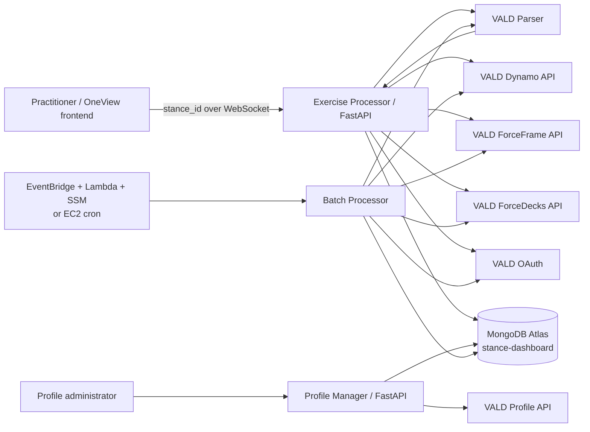
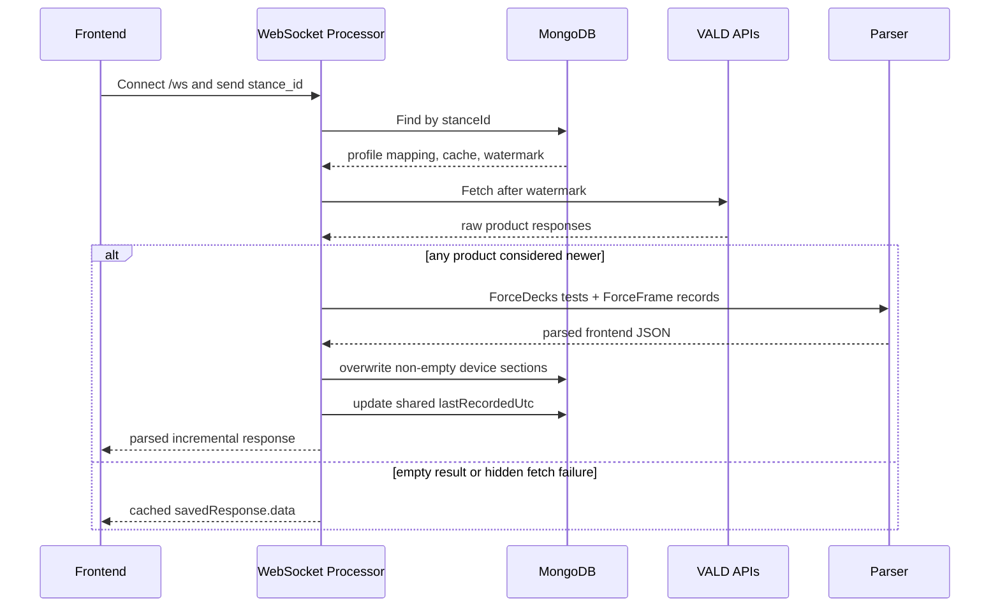
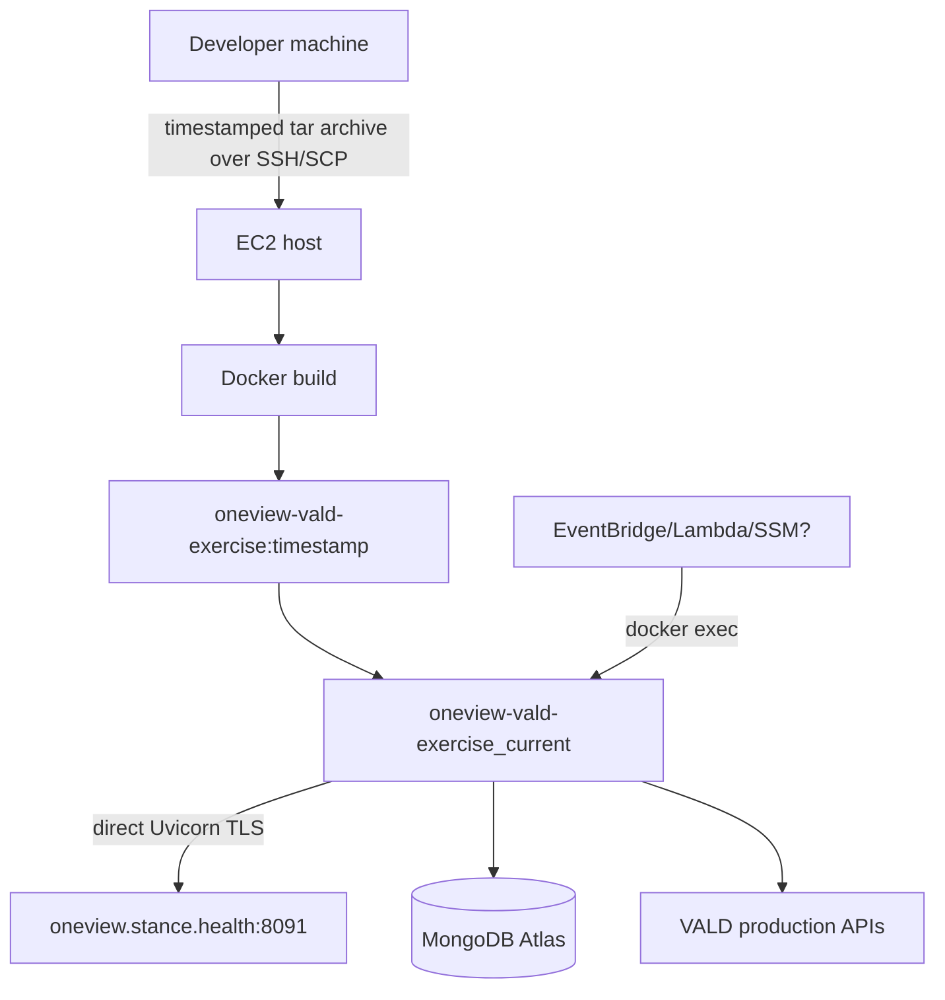
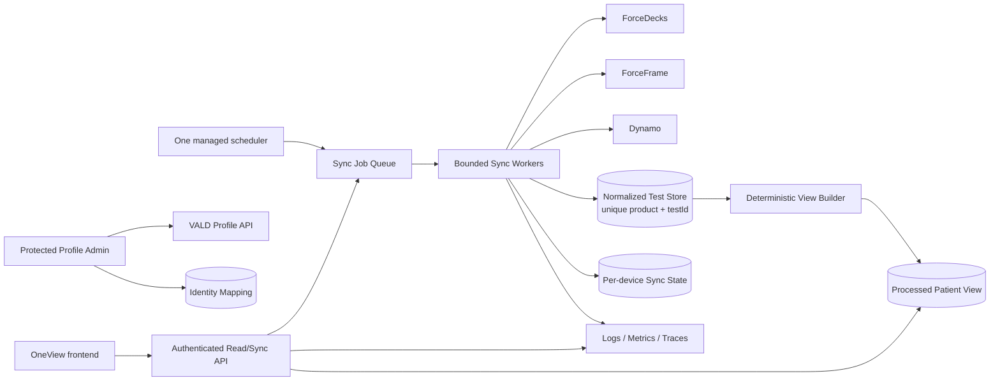

# OneView–VALD Backend: Complete Project Documentation

---

## Table of contents

1. [Executive summary](#1-executive-summary)
2. [Business purpose and users](#2-business-purpose-and-users)
3. [System scope](#3-system-scope)
4. [Architecture](#4-architecture)
5. [Identity model](#5-identity-model)
6. [Current online request flow](#6-current-online-request-flow)
7. [VALD integrations](#7-vald-integrations)
8. [Transformation and parser rules](#8-transformation-and-parser-rules)
9. [MongoDB model](#9-mongodb-model)
10. [Application interfaces](#10-application-interfaces)
11. [Profile Manager](#11-profile-manager)
12. [Batch processing and scheduling](#12-batch-processing-and-scheduling)
13. [Configuration and dependencies](#13-configuration-and-dependencies)
14. [Local development](#14-local-development)
15. [Production deployment](#15-production-deployment)
16. [Logging, monitoring, and troubleshooting](#16-logging-monitoring-and-troubleshooting)
17. [Repository inventory and code classification](#17-repository-inventory-and-code-classification)
18. [Known issues and risks](#18-known-issues-and-risks)
19. [Unwanted and removable material](#19-unwanted-and-removable-material)
20. [Optimization and modernization roadmap](#20-optimization-and-modernization-roadmap)
21. [Recommended target architecture](#21-recommended-target-architecture)
22. [Testing strategy](#22-testing-strategy)
23. [Operational runbooks](#23-operational-runbooks)
24. [Glossary](#24-glossary)

---

## 1. Executive summary

OneView is a Python integration backend that connects patient identity from the
Stance ecosystem with physical-performance testing data held by VALD. A frontend
sends a `stance_id`; the service resolves that patient to a VALD athlete profile,
retrieves new tests from VALD ForceDecks, ForceFrame, and Dynamo APIs, converts raw
device responses into a unified graph-ready JSON structure, saves the processed
response in MongoDB, and returns it to the frontend.

The repository contains four functional systems:

1. **Exercise Processor:** FastAPI WebSocket service for on-demand synchronization.
2. **VALD parser and clients:** Product-specific retrieval plus frontend-oriented
   normalization.
3. **Profile Manager:** Administrative UI/API/CLI for linking and repairing patient
   and VALD profile associations.
4. **Batch Processor:** Six-process bulk synchronization with file-based progress
   and scheduler integrations.

The current code demonstrates a useful product concept and a capable parser, but
the synchronization model has correctness and security problems that must be
addressed before it can be considered a dependable longitudinal record:

- Incremental results can replace a complete device history.
- One timestamp is shared by all three products.
- Dynamo is fetched but not parsed or persisted by the current online path.
- Fetch failures are often reported as “no new data.”
- A database credential is embedded in source as a fallback.
- Administrative and diagnostic operations have no visible authentication.
- Active and legacy implementations are mixed in the same repository and, in some
  cases, in the same module.

The processed MongoDB response should currently be treated as a cache optimized for
frontend display, not as an authoritative clinical or measurement record. Raw VALD
product APIs remain the apparent source of truth for measurements.

---

## 2. Business purpose and users

### 2.1 Problem being solved

A patient is identified in Stance, while physical tests are recorded in multiple
VALD products. Without an integration layer, a practitioner would need to find the
same person in several systems, understand different device schemas, compare
historical sessions manually, and resolve broken profile mappings.

OneView attempts to provide:

- One patient view across VALD products.
- Fast repeat reads from a processed MongoDB cache.
- Exercise and metric naming suitable for a frontend.
- Historical sessions and progress graphs.
- Left/right comparison, asymmetry, and percentage change.
- Administrative correction of identity mappings.
- Scheduled refresh of all linked patients.

### 2.2 Likely users

The system supports the following operational roles:

| User | Likely activity |
|---|---|
| Practitioner or trainer | Opens a patient and reviews performance history |
| Operations/support | Investigates missing results and failed associations |
| Profile administrator | Links, unlinks, or repairs Stance/VALD profiles |
| DevOps engineer | Deploys the container and operates nightly batch jobs |
| Developer/data engineer | Maintains fetch logic, parsers, and MongoDB structures |

### 2.3 Source-of-truth model

| Information | Current source |
|---|---|
| Stance patient ID | Stance ecosystem |
| VALD athlete profile | VALD Profile API |
| Device measurements | ForceDecks, ForceFrame, and Dynamo APIs |
| Patient-to-VALD association | MongoDB `vald-exercise-data` plus VALD `syncId` |
| Frontend response | MongoDB `savedResponse.data` |
| Sync state | MongoDB `lastRecordedUtc` |
| Normative percentiles | CSV files under `normative-new/`; unused by runtime |

---

## 3. System scope

### 3.1 In scope

- OAuth client-credentials authentication with VALD.
- Fetching athlete tests from three VALD product APIs.
- Fetching ForceDecks trials and ForceFrame computed metrics.
- Parsing ForceDecks and ForceFrame into a common response.
- MongoDB caching and timestamp updates.
- WebSocket delivery to a frontend.
- Profile search, link, unlink, missing-sync-ID repair, and mismatch correction.
- Bulk refresh and scheduler integration.
- Health, inspection, raw-data debugging, and batch-status endpoints.

### 3.2 Not implemented or not proven

- Full Dynamo frontend transformation.
- Authentication and role-based access control.
- A raw immutable measurement store.
- Cross-system transactions for profile mutations.
- Reliable session-level incremental merging.
- Formal MongoDB schema validation or migrations.
- Verified MongoDB indexes and uniqueness constraints.
- Retries, exponential backoff, circuit breaking, or rate-limit handling.
- Automated unit/integration/end-to-end tests.
- Metrics, tracing, alerts, and structured audit logs.
- Runtime use of normative datasets.
- A single authoritative production scheduler and deployment revision.

---

## 4. Architecture

### 4.1 System context



### 4.2 Runtime components

| Component | Entry point | Current role |
|---|---|---|
| Exercise Processor | `update_vald_exercises_app.py` | Online WebSocket and diagnostics |
| Fetch Coordinator | `src/file_handling/data_updater.py::fetch_new_data_only` | Orchestrates all product fetches |
| Device clients | `src/VALD/src/fetch/vald_fetch/src/` | Raw external HTTP calls |
| Token utility | `src/VALD/src/utils/vald_fetch_utils.py` | Process-local OAuth token cache |
| Parser | `src/parsers/vald_api_parser.py` | Frontend normalization |
| Mongo repository | `src/file_handling/vald_exercise_db.py` | Active collection access |
| Batch | `batch_reprocess_vald.py` | Six-worker bulk processing |
| Profile Manager API/UI | `vald-profile-functions/api.py` and `index.html` | Browser administration |
| Profile Manager CLI | `vald-profile-functions/main.py` | Interactive administration |
| Production deploy | `deploy_vald_exercise.sh` | Current-looking EC2 Docker deployment |

### 4.3 Architectural characteristics

- The main service is declared asynchronous but executes synchronous HTTP and
  PyMongo operations inside the event loop.
- OAuth tokens are cached per Python process, not shared between processes.
- Each batch worker has its own token cache and its own Mongo connections.
- Mongo clients are usually created and closed per repository operation.
- Processed frontend data and identity mapping live in the same Mongo document.
- Incremental synchronization is driven by modification timestamps supplied to
  VALD APIs.
- TLS is terminated directly by Uvicorn in the current deployment script; no
  reverse proxy is shown.

---

## 5. Identity model

### 5.1 Identifier relationship

```text
stanceId
   │
   ├── identifies the Stance patient in MongoDB
   ├── is normally copied to VALD syncId and externalId
   └── resolves to associatedValdId[0]
                         │
                         ├── ForceDecks ProfileId
                         ├── ForceFrame ProfileId
                         └── Dynamo athleteId
```

The repository does not store a permanent physical-device assignment. It assumes
all product tests belonging to the same VALD athlete profile represent the same
person.

### 5.2 Important assumptions

- `stanceId` is assumed to be stable and unique.
- `associatedValdId` is stored as an array, but the online and batch processors use
  only element zero.
- The same VALD profile identifier is assumed to work across all product APIs.
- The Stance ID is normally also the VALD `syncId` and `externalId`.
- Name fields are display/fallback fields, not used as the main exercise-fetch key.

### 5.3 Identity risks

- Multiple associated VALD IDs are silently ignored after the first.
- MongoDB and VALD can disagree because link/unlink operations are not atomic.
- The Profile Manager import request does not include the selected `profileId`.
  Profile selection therefore depends on VALD import behavior for `syncId` and
  `externalId`, rather than an explicit profile identifier in the request.
- Consent fields are unconditionally set to `true` during profile import instead of
  being derived from stored consent records.
- No audit record identifies who performed a link or unlink.

---

## 6. Current online request flow

### 6.1 Request

The frontend connects to `WebSocket /ws` and sends one message:

```json
{
  "stance_id": "<stance-patient-id>"
}
```

The connection waits up to 300 seconds for this first message. The endpoint handles
one request and then completes; it is not a persistent subscription.

### 6.2 Sequence



### 6.3 Detailed behavior

1. Accept the WebSocket connection.
2. Parse JSON; missing `stance_id` becomes string value `"0"`.
3. Query `stance-dashboard.vald-exercise-data` by `stanceId`.
4. Reject the request if the document or `associatedValdId[0]` is absent.
5. Read the display name and existing `savedResponse.data`.
6. Convert one `lastRecordedUtc` into three identical device timestamps.
7. Call `fetch_new_data_only` synchronously.
8. If it returns a truthy result:
   - Extract ForceFrame records.
   - Extract `forceDeck.tests`.
   - Do not pass Dynamo to the parser.
   - Parse ForceDecks and ForceFrame.
   - Save non-empty parsed device sections.
   - Find the maximum timestamp across fetched product responses.
   - Update the shared watermark.
   - Return the parsed incremental subset.
9. Otherwise return the cached response, or `{}` if no cache exists.
10. Serialization converts unsupported values using `str`.

### 6.4 Current response variants

Document missing:

```json
{
  "success": "False",
  "message": "No document in vald-exercise-data for stance_id: ..."
}
```

New data:

```json
{
  "success": "True",
  "message": "New data processed and stored",
  "data": {},
  "isNewData": true,
  "stanceId": "...",
  "valdProfileId": "...",
  "userName": "..."
}
```

Cached data:

```json
{
  "success": "True",
  "message": "No new data, returning existing",
  "data": {},
  "isNewData": false,
  "stanceId": "..."
}
```

Contract inconsistencies:

- `success` is a string, while `isNewData` is a JSON Boolean.
- Error responses do not use a stable error code.
- A VALD failure can return the successful cached-data variant.
- New-data responses return the incremental parse, not necessarily the full cache.

---

## 7. VALD integrations

### 7.1 Authentication

The clients use OAuth 2.0 client credentials:

```text
Token endpoint: VALD production OAuth
Grant: client_credentials
Audience: vald-api-external
Credentials: VALD_CLIENT_ID and VALD_CLIENT_SECRET
```

The access token is cached in a module-level dictionary until 60 seconds before
expiry. Each process maintains its own cache. Some authentication calls have no
explicit timeout in the exercise-fetch implementation; the Profile Manager client
uses 30-second timeouts.

### 7.2 Product summary

| Product | Profile parameter | Incremental parameter | Extra calls | Parsed online? |
|---|---|---|---|---|
| Dynamo | `athleteId` | `modifiedFromUTC` | Repetitions included in test response | No |
| ForceDecks | `ProfileId` | `ModifiedFromUtc` | Tenant profiles plus trials per test | Yes |
| ForceFrame | `ProfileId` | `ModifiedFromUtc` | Metrics per test | Yes |

### 7.3 Default historical boundary

When a timestamp is absent or `"0"`, the product clients default to:

```text
2022-02-25T04:04:24.864Z
```

Therefore an initial fetch does not guarantee retrieval of tests older than that
date. A separate maintenance script resets selected records to 2019, but the
product clients still use the supplied 2019 value only when it is stored rather
than absent.

### 7.4 Dynamo

The Dynamo endpoint is requested with repetition summaries and individual
repetitions enabled. A helper can create summary and repetition pandas DataFrames,
but the online service keeps the raw JSON.

Newness is based on the latest `analysedDateUTC` found in list values inside a
dictionary response. If the live API returns a top-level list or a different
shape, timestamp discovery can fail.

Current limitation: Dynamo may set `hasNewData=true`, but no Dynamo data is passed
to `parse_vald_api_response`, so it is not added by the current online/batch parse.

### 7.5 ForceDecks

Current flow:

1. Fetch all tenant profiles from the VALD Profile endpoint.
2. Build a simplified athlete list.
3. Check that the requested profile ID is present.
4. Fetch tests filtered by `ProfileId` and `ModifiedFromUtc`.
5. For each test, fetch trials from a versioned team/test endpoint.
6. Attach trials directly to the test.
7. Normalize an older structure where trial-only objects were separate test-list
   entries.

Performance characteristics:

- One tenant-wide profile request per patient synchronization.
- One tests request per patient.
- One trials request per returned test.
- Several calls lack explicit timeouts.
- A failed trial request logs an error but keeps the parent test, which may parse as
  an exercise with no metrics.

### 7.6 ForceFrame

Current flow:

1. Fetch tests from the ForceFrame `tests/v2` endpoint.
2. Accept top-level lists or dictionary keys such as `tests`, `results`, or `data`.
3. For each test, fetch additional computed metrics.
4. Merge non-null fields matching `outer|inner` + `Left|Right` + suffix.
5. Convert the enriched list to a pandas DataFrame for logging/older consumers.
6. Return the enriched raw list to the online parser.

The test and metrics calls use a 30-second timeout. Metrics failures return an empty
dictionary and do not fail the whole test fetch, so partial ForceFrame records are
possible without an explicit partial-success status.

### 7.7 VALD Profile API

The separate Profile Manager client supports:

- List/search profiles.
- Fetch profile by ID.
- Check profile existence by sync ID.
- Import a profile.
- Delete sync IDs.
- Merge profiles.
- Add, delete, or replace groups.

Not all client capabilities are exposed by the browser API. Profile merge and group
methods are client utilities but have no corresponding route in `api.py`.

---

## 8. Transformation and parser rules

### 8.1 Top-level output

```json
{
  "forceFrame": {},
  "forceDeck": {},
  "is_forceframe": false,
  "is_forcedeck": false
}
```

The parser has no Dynamo parameter or `is_dynamo` output.

### 8.2 ForceDecks exercise names

The parser maps selected VALD codes to readable names. Examples:

| Code | Output name |
|---|---|
| `CMJ` | Counter Movement Jump |
| `SQT` | Squat Assessment |
| `DJ` | Drop Jump |
| `SJ` | Squat Jump |
| `PUSHUPT` | Push Up |
| `IMTP` | Isometric Mid-Thigh Pull |
| `SLSQT` | Single Leg Squat |
| `SLSB` | Single Leg Stand |

Unknown codes are retained unchanged.

### 8.3 ForceDecks session and metric rules

- Group tests by mapped exercise name.
- Sort by `recordedDateUtc`, falling back to `modifiedDateUtc`, oldest first.
- Use `sessionDate` for one test and `sessionDates` for multiple tests.
- Read trials from list or nested `trials`, `items`, `data`, or `results` lists.
- Convert metric names from upper snake case to camel case.
- Prefer result-level limb over trial-level limb.
- Map Left/Right/Both/Bilateral/Trial/Asym to frontend limb keys.
- Default an unknown limb to bilateral.
- If a metric/limb has repeated values in one test, choose the value with the
  greatest absolute magnitude.
- Align each metric array to session-date indexes and insert `{}` where a session
  lacks that metric.
- Calculate percentage change only when the same limb/value exists in the previous
  session.
- Preserve supplied asymmetry; calculate graph asymmetry when left and right exist
  and supplied asymmetry does not.

### 8.4 ForceFrame exercise and metric rules

- Combine `testName` and `testPosition` unless position already starts with name.
- Group by the combined exercise name and sort by test date oldest first.
- Discover fields dynamically:
  - `outerLeftMaxForce` becomes metric `maxForce`, side `left`.
  - `outerRightMaxForce` becomes metric `maxForce`, side `right`.
  - `innerLeftMaxForce` becomes metric `innerMaxForce`, side `left`.
- Drop a metric if every left/right value across all sessions is zero or null.
- Infer common units from suffixes: `N/kg`, `N/s`, `N·s`, seconds, repetitions, or
  default Newtons.
- Calculate per-side percentage change and graph asymmetry.

### 8.5 Dual-movement ForceFrame exercises

Selected exercises split outer and inner measurements into named movements:

| Exercise contains | Outer label | Inner label |
|---|---|---|
| Hip AD/AB | abduction | adduction |
| Hip IR/ER | externalRotation | internalRotation |
| Shoulder IR/ER | externalRotation | internalRotation |
| Ankle Inversion/Eversion | eversion | inversion |

The ratio is calculated per side and session as:

```text
inner movement value / outer movement value
```

### 8.6 Calculations

Percentage change:

```text
(current - previous) / previous * 100
```

When `previous == 0`, the current helper returns the current raw value, which is not
dimensionally a percentage and should be corrected or explicitly specified.

Common asymmetry calculation:

```text
abs(left - right) / max(left, right) * 100
```

This is normally suitable for positive force values. A definition using absolute
denominators should be considered if negative metrics are possible.

### 8.7 Graph output

Each metric graph can contain:

- Graph type.
- Session dates as x-axis values.
- Left, right, asymmetry, or bilateral y-axis arrays.
- Unit and y-axis label.
- Maximum and average summaries.
- Static color `black`.

Graph types are looked up from three expected CSV files under `metric-pool/`.
That directory is absent from this checkout. Import continues with warnings and
uses default single/multi and unilateral/bilateral graph types.

ForceDecks graph units are currently empty even where units may be available in VALD
definitions.

### 8.8 Example frontend structure

```json
{
  "forceDeck": {
    "Counter Movement Jump": {
      "sessionDates": [
        "2026-01-01 10:00:00",
        "2026-02-01 10:00:00"
      ],
      "data": {
        "exampleMetric": [
          {"left": 100, "right": 105},
          {
            "left": 110,
            "right": 112,
            "percentChange": {"left": 10.0, "right": 6.67}
          }
        ]
      },
      "graph": {
        "exampleMetric": {
          "graph_type": "Dual_Line_With_Benchmark_Multi",
          "x_axis_entities": ["2026-01-01 10:00:00", "2026-02-01 10:00:00"],
          "y_axis_entities_left": [100, 110],
          "y_axis_entities_right": [105, 112]
        }
      }
    }
  }
}
```

---

## 9. MongoDB model

### 9.1 Active namespace

```text
Database: stance-dashboard
Collection: vald-exercise-data
Lookup key: stanceId
```

Database and collection names are hardcoded in the active repository class.

### 9.2 Representative document

```json
{
  "_id": "<MongoDB ObjectId or other identifier>",
  "stanceId": "<stance-patient-id>",
  "stanceFullName": "<display name>",
  "valdFullName": "<VALD display name>",
  "sex": "<optional>",
  "dateOfBirth": "<optional>",
  "associatedValdId": ["<VALD profile ID>"],
  "valdSyncId": "<usually stanceId>",
  "associatedRunscribeId": [],
  "associatedOutputId": [],
  "lastRecordedUtc": "<MongoDB Date>",
  "savedResponse": {
    "data": {
      "forceDeck": {},
      "forceFrame": {},
      "dynamo": {},
      "is_forcedeck": true,
      "is_forceframe": true,
      "is_dynamo": false
    }
  },
  "createdAt": 0,
  "updatedAt": 0
}
```

Actual documents may contain additional identity and integration fields.

### 9.3 Field semantics

| Field | Meaning in current code |
|---|---|
| `stanceId` | Primary lookup value received from frontend |
| `associatedValdId` | Candidate VALD profile IDs; only first is processed |
| `valdSyncId` | Stance identifier stored on the VALD profile |
| `lastRecordedUtc` | One shared incremental watermark for all devices |
| `savedResponse.data` | Cached processed frontend data |
| `is_force*` / `is_dynamo` | Derived presence flags |
| `updatedAt` | Current server epoch milliseconds on update |
| `createdAt` | Epoch milliseconds set by repository upsert only |

### 9.4 Read and write behavior

- A new Mongo client is created for most operations and then closed.
- Read failures are logged and returned as `None` or zero timestamps.
- Missing watermark produces `"0"` for all products.
- Saving starts with existing `savedResponse.data`.
- Only non-empty incoming device sections replace stored device sections.
- Device presence flags are recalculated.
- Saving does not merge individual tests, exercises, metrics, or sessions.
- The calling service ignores the Boolean result of the save and may update the
  watermark even when data persistence failed.

### 9.5 Indexes that should exist

Production indexes are not visible in the repository. Recommended minimum:

```javascript
db.getCollection("vald-exercise-data").createIndex(
  { stanceId: 1 },
  { unique: true, name: "uniq_stanceId" }
)

db.getCollection("vald-exercise-data").createIndex(
  { associatedValdId: 1 },
  { name: "idx_associatedValdId" }
)

db.getCollection("vald-exercise-data").createIndex(
  { valdSyncId: 1 },
  { sparse: true, name: "idx_valdSyncId" }
)
```

These must be preceded by a duplicate-data audit.

### 9.6 Legacy collection

`src/file_handling/mongodb_updater.py` reads and writes the older `matches`
collection. It is not called by the current WebSocket or batch path. Some unused
functions in `data_updater.py` still import it. Do not confuse `matches` with the
active `vald-exercise-data` collection.

---

## 10. Application interfaces

### 10.1 Exercise Processor endpoints

| Method | Path | Purpose | Mutation | Exposure risk |
|---|---|---|---|---|
| WebSocket | `/ws` | Fetch/cache patient exercise data | Yes | Patient data and external calls |
| GET | `/health` | Static process health | No | Does not test dependencies |
| GET | `/debug-raw/{stance_id}` | Force full historical API request and summarize raw fields | No DB write | Expensive and patient-sensitive |
| GET | `/debug-ff-fields/{stance_id}` | Show ForceFrame raw metric field names | No DB write | Expensive and patient-sensitive |
| GET | `/cron-status` | Batch history and live progress | No | Operational information disclosure |
| GET | `/inspect/{stance_id}` | Stored exercises, dates, metrics, IDs, and flags | No | Patient/identifier disclosure |
| POST | `/stop-batch` | SIGKILL batch processes and delete progress/results | Yes/destructive | Critical without authorization |

`reset_timestamps(stance_id)` exists as a function but has no FastAPI decorator, so
it is not currently an HTTP endpoint.

### 10.2 CORS and access control

The exercise service allows all origins, methods, and headers and enables
credentials. The Profile Manager also allows all origins. No authentication,
authorization, API key, user session, or role checks are visible.

### 10.3 Health semantics

`GET /health` always returns a static healthy response if the process can serve the
request. It does not verify:

- MongoDB connectivity.
- VALD credentials or OAuth.
- Disk/mount writability.
- Batch health.
- Parser graph configuration.

Separate liveness and readiness endpoints are recommended.

---

## 11. Profile Manager

### 11.1 Components

| File | Role |
|---|---|
| `vald-profile-functions/api.py` | FastAPI browser backend |
| `vald-profile-functions/index.html` | Single-file static administration UI |
| `vald-profile-functions/main.py` | Interactive terminal UI |
| `vald-profile-functions/vald_client.py` | VALD Profile API client |
| `vald-profile-functions/db_operations.py` | MongoDB association operations |

### 11.2 Browser API routes

| Method | Path | Purpose |
|---|---|---|
| GET | `/api/patient/{stance_id}` | Return Mongo patient document |
| GET | `/api/patient/{stance_id}/vald` | Return Mongo document plus linked VALD profiles |
| GET | `/api/samples` | Return sample patient mappings |
| GET | `/api/search/db?name=` | Regex name search |
| GET | `/api/search/db/vald-id/{vald_id}` | Find DB references to a VALD profile |
| GET | `/api/vald/profile/{profile_id}` | Fetch VALD profile |
| GET | `/api/vald/search` | Search by sync or external ID |
| POST | `/api/unlink` | Delete VALD sync ID and remove DB association |
| POST | `/api/link` | Import VALD sync/external ID and set DB association |
| GET | `/api/null-syncid` | Cross-reference profiles lacking sync IDs |
| POST | `/api/attach-syncid` | Repair missing sync IDs for selected patients |
| GET | `/` | Serve the HTML UI |

### 11.3 Link flow

1. Read the Stance/Mongo document.
2. Fetch the selected VALD profile.
3. Build an import payload using target profile values with Stance fallbacks.
4. Set `syncId` and `externalId` to `stanceId`.
5. Set three consent flags to true.
6. Import through VALD.
7. Replace Mongo `associatedValdId` with exactly one selected ID.
8. Set Mongo `valdSyncId`.

### 11.4 Unlink flow

1. Fetch the VALD profile.
2. Determine a sync ID from the profile or fall back to `stanceId`.
3. Delete that sync ID through VALD.
4. Pull the selected profile ID from Mongo.
5. Clear Mongo `valdSyncId`.

### 11.5 Failure model

VALD and Mongo writes are sequential, independent operations. There is no rollback.
Examples:

- VALD succeeds and Mongo fails: systems disagree.
- Unlink succeeds but relink fails during mismatch repair: patient remains unlinked.
- HTTP response can say overall success while `db_updated` is false.

### 11.6 UI deployment limitation

The HTML currently hardcodes:

```text
http://localhost:8765
```

This works only when the browser can reach the backend at that address. It should
use same-origin relative URLs or runtime configuration for deployment.

---

## 12. Batch processing and scheduling

### 12.1 Batch selection

The batch queries all `vald-exercise-data` documents with a non-empty
`associatedValdId`, projects identity/name fields, and splits the result into six
equal index ranges.

### 12.2 Modes

```bash
python batch_reprocess_vald.py
```

macOS-oriented launcher that opens six Terminal windows.

```bash
python batch_reprocess_vald.py --chunk 0
```

Runs one chunk directly.

```bash
python batch_reprocess_vald.py --server
```

Starts six background worker processes and waits for completion; intended for EC2.

### 12.3 Progress files

```text
temporary/batch_progress_chunk_N.json
temporary/batch_results_chunk_N.json
temporary/batch_log_chunk_N.txt
temporary/cron_logs.log
```

Progress tracks:

- `done`
- `no_new_data`
- `failed` with a reason

### 12.4 Resume behavior

On restart, the worker skips all IDs in `done`, `no_new_data`, **and `failed`**.
Consequently, resume does not retry failed patients. Server mode clears progress
files after all worker processes exit.

### 12.5 Batch correctness risks

- The launcher and every worker independently query MongoDB.
- The query has no explicit sort.
- MongoDB return order is not a stable chunking contract.
- Different workers can therefore receive different orderings, causing overlap or
  omissions, especially if documents change during a run.
- A worker catches per-patient exceptions and still exits successfully.
- Aggregated status is `SUCCESS` when all worker processes exit zero and result
  files exist, even if `failed > 0`.
- Result files from an older run are not cleared before launch and can be mistaken
  for current results if a worker fails before writing.
- The same incremental merge and shared-watermark problems affect batch mode.

### 12.6 Scheduler options in the repository

#### Lambda + EventBridge + SSM

`lambda_trigger_reprocess.py` expects EventBridge to invoke Lambda at 9 PM IST.
Lambda sends an SSM command to EC2 that runs:

```text
docker exec oneview-vald-exercise_current python batch_reprocess_vald.py --server
```

This is the scheduler most compatible with the current-looking Docker deployment.
It requires an SSM-managed EC2 instance and appropriate IAM permissions.

#### EC2 cron

`setup_ec2_cron.sh` installs a 15:30 UTC daily cron job. It expects release
directories and a virtual environment layout that differ from
`deploy_vald_exercise.sh`. It therefore appears outdated or incompatible.

The repository does not select one of these mechanisms as the authoritative
production scheduler.

---

## 13. Configuration and dependencies

### 13.1 Required environment variables

| Variable | Required by | Purpose |
|---|---|---|
| `MONGO_URI` | Exercise service, batch, maintenance scripts | MongoDB connection |
| `VALD_CLIENT_ID` | All VALD clients | OAuth client ID |
| `VALD_CLIENT_SECRET` | All VALD clients | OAuth client secret |
| `VALD_TENANT_ID` | Profile Manager | VALD tenant ID |

The exercise-fetch coordinator currently uses a hardcoded tenant ID rather than
`VALD_TENANT_ID`.

### 13.2 Optional or legacy variables

| Variable | Usage |
|---|---|
| `WORKSPACE_ROOT` | Builds older data-directory paths in fetch coordination |
| `PROFILES_DIR` | Older profile-directory path and ForceDeck argument |
| `EXACT_MATCHES_JSON_PATH` | Legacy `exact_matches.json` helpers |
| `MONGODB_DB` | Profile Manager DB override |
| `MONGO_READ_URI` | Profile Manager fallback read URI |
| `EC2_INSTANCE_ID` | Lambda scheduler |
| `S3_BUCKET` | Documented as optional by Lambda but not used in code |

### 13.3 Python dependencies

| Package | Role |
|---|---|
| FastAPI / Starlette | HTTP and WebSocket application |
| Uvicorn | ASGI server |
| PyMongo / dnspython | MongoDB and Atlas SRV connectivity |
| requests / httpx | HTTP clients; active VALD clients use `requests` |
| pandas | Dynamo/ForceFrame DataFrame compatibility and processing |
| python-dotenv | `.env` loading |
| filelock | Legacy filesystem pipeline locking |
| websockets | WebSocket client/runtime support |
| Pydantic | Profile Manager request models |
| python-multipart | FastAPI support dependency |

`httpx` is listed but not used by the main integration path.

### 13.4 Secret handling

- `.env` exists locally but is not explicitly ignored by the current `.gitignore`.
- `.env` should have mode `600` and must never be committed.
- The active Mongo repository and older Mongo modules contain a credential-bearing
  fallback URI in source. Treat the credential as compromised and rotate it.
- The production deploy script packages `.env` into every uploaded release archive.
  Use AWS Secrets Manager, SSM Parameter Store, or a protected server-side env file
  instead.

---

## 14. Local development

### 14.1 Environment setup

```bash
python3 -m venv .venv
source .venv/bin/activate
python -m pip install --upgrade pip
pip install -r requirements.txt
```

Recommended `.env` shape:

```dotenv
MONGO_URI=<secret MongoDB URI>
VALD_CLIENT_ID=<secret client ID>
VALD_CLIENT_SECRET=<secret client secret>
VALD_TENANT_ID=<tenant ID>
WORKSPACE_ROOT=.
PROFILES_DIR=profiles
```

### 14.2 Run the Exercise Processor

```bash
python -m uvicorn update_vald_exercises_app:app \
  --host 0.0.0.0 \
  --port 8091 \
  --reload
```

```text
Health:      http://localhost:8091/health
OpenAPI:     http://localhost:8091/docs
WebSocket:   ws://localhost:8091/ws
```

### 14.3 Run the Profile Manager

Run from its directory because it uses local absolute-style imports:

```bash
cd vald-profile-functions
python -m uvicorn api:app --host 0.0.0.0 --port 8765 --reload
```

```text
UI:          http://localhost:8765/
OpenAPI:     http://localhost:8765/docs
```

### 14.4 Run locally with Docker

The Dockerfile default command is invalid for this checkout, so override it:

```bash
docker build -t oneview-vald .

docker run --rm \
  --name oneview-vald-local \
  --env-file .env \
  -p 8091:8091 \
  oneview-vald \
  python -m uvicorn update_vald_exercises_app:app \
    --host 0.0.0.0 --port 8091
```

### 14.5 Safe development warning

There is no environment guard or dry-run mode in the online service. If `.env`
contains production credentials, local requests call production VALD endpoints and
write to the configured MongoDB database.

---

## 15. Production deployment

### 15.1 Current-looking path

`deploy_vald_exercise.sh` is the only deployment script that directly and
consistently starts the present Exercise Processor module.



### 15.2 Deployment steps

1. Verify SSH connectivity using a local PEM key.
2. Create a timestamped tar archive, excluding Git, virtual environments,
   bytecode, and older archives.
3. Upload to `/home/ubuntu/oneview-app/vald-exercise-releases/`.
4. Extract into a timestamped release directory.
5. Build image `oneview-vald-exercise:<timestamp>`.
6. Stop and remove `oneview-vald-exercise_current`.
7. Start the new container using `.env` from the extracted release.
8. Mount persistent `data`, `temporary`, host cron logs, and Let's Encrypt
   certificate directories.
9. Start Uvicorn with TLS on container port 8091.
10. Publish host ports 8091 and 8090 to the same container port.
11. Sleep five seconds and display running containers.

Production WebSocket documented by the script:

```text
wss://oneview.stance.health:8091/ws
```

### 15.3 Deployment limitations

- Deployment stops the old container before starting the new one; it is not truly
  zero downtime.
- No application health check is performed before declaring success.
- No automatic rollback is implemented.
- Both public ports map to the same service, which is confusing and should be
  removed unless deliberately required.
- TLS termination inside Uvicorn complicates certificate permissions and rotation.
- Old images, releases, and secret-containing archives are not cleaned up.
- Environment secrets are copied into the release.
- EC2 host, port, domain, certificate location, and application name are hardcoded.

### 15.4 Outdated deployment paths

- `deploy_ec2.sh` starts missing `app:app` in addition to the VALD service.
- `deploy_updater.sh` expects missing `update_matches_app.py`.
- `docker-compose.yml` references both missing modules.
- The Dockerfile defaults to missing `app:app` on port 8089.
- `setup_ec2_cron.sh` expects a different release/virtualenv layout.

These should not be used without deliberate repair.

### 15.5 Recommended production layout

- Application image built in CI from a committed revision.
- Secrets injected at runtime from AWS Secrets Manager/SSM.
- Application behind an ALB or Nginx with managed TLS.
- Container listens on internal HTTP only.
- Health/readiness check before traffic shift.
- Blue/green or rolling replacement with rollback.
- One public port, ideally standard 443.
- Immutable release metadata including Git SHA.

---

## 16. Logging, monitoring, and troubleshooting

### 16.1 Current logging

Logging is console-based with time, level, logger name, and message. Verbose
PyMongo, urllib3, and requests loggers are reduced. Batch workers redirect stdout
and stderr into per-chunk text files.

No JSON structured logs, correlation IDs, trace IDs, request IDs, metrics, or
external log aggregation configuration are present.

### 16.2 Current operational inspection

```bash
docker ps
docker logs --tail 200 oneview-vald-exercise_current
curl -k https://localhost:8091/health
```

Batch inspection:

```bash
docker exec oneview-vald-exercise_current \
  python batch_reprocess_vald.py --server
```

Application endpoints:

```text
/cron-status
/inspect/{stance_id}
/debug-raw/{stance_id}
/debug-ff-fields/{stance_id}
```

These endpoints should be restricted before production use.

### 16.3 Common symptoms

| Symptom | Likely cause |
|---|---|
| “No document” | `stanceId` absent or wrong collection/database |
| “No associatedValdId” | Patient not linked to VALD |
| Cached response despite recent test | Shared watermark, API failure hidden as no data, or modification timestamp issue |
| Only newest session visible | Device-level overwrite after incremental parse |
| Dynamo flag/data missing | Dynamo not supported by top-level parser |
| ForceDeck exercise with no metrics | Trials request failed or payload shape changed |
| Missing ForceFrame metrics | Extra metrics call failed or all values were zero/null |
| Graph types differ from design | Missing `metric-pool` CSV files |
| Profile Manager UI cannot call API | Hardcoded `localhost:8765` in browser JavaScript |
| Docker exits with import error | Default `app:app` module does not exist |
| Batch reports success with failures | Aggregator ignores patient failure count in status decision |

### 16.4 Monitoring that should be added

- Requests, duration, errors, and active WebSockets.
- VALD calls by product/endpoint/status/latency.
- OAuth failures and token refresh count.
- Patients updated, unchanged, partial, and failed.
- Tests fetched, parsed, merged, and skipped.
- Watermark before/after per device.
- Mongo read/write latency and failures.
- Batch size, progress, failure rate, duration, and stuck-worker alerts.
- Cache age and last successful synchronization per patient/device.

---

## 17. Repository inventory and code classification

### 17.1 Classification legend

- **Active:** Called by the current online or batch path.
- **Supporting:** Used operationally or by an active component.
- **Optional admin:** Separate profile-management capability.
- **Maintenance:** One-time or repair utility; run carefully.
- **Mixed:** Contains both active and legacy code.
- **Legacy/broken:** References an older architecture or missing files.
- **Analysis asset:** Not used by current runtime.

### 17.2 Root files

| File | Classification | Notes |
|---|---|---|
| `update_vald_exercises_app.py` | Active | Main WebSocket and diagnostics |
| `batch_reprocess_vald.py` | Active | Bulk sync used by scheduler candidates |
| `requirements.txt` | Active | Runtime packages |
| `pyproject.toml` | Supporting | Formatting/test configuration; tests absent |
| `Dockerfile` | Mixed/broken default | Builds dependencies correctly, starts missing `app:app` by default |
| `deploy_vald_exercise.sh` | Active-looking | Most consistent production deploy path |
| `lambda_trigger_reprocess.py` | Active candidate | AWS scheduler compatible with current container name |
| `setup_ec2_cron.sh` | Legacy/incompatible | Expects different release and virtualenv layout |
| `deploy_ec2.sh` | Legacy/mixed | References missing main app but also starts VALD service |
| `deploy_updater.sh` | Legacy/broken | Requires missing updater module |
| `docker-compose.yml` | Legacy/broken | Both configured modules are missing |
| `run_script.sh` | Legacy | References external `/home/ubuntu/scrapper` programs |
| `cleanup_zero_inner_metrics.py` | Maintenance | Removes all-zero inner ForceFrame metrics; writes by default |
| `reset_missing_forcedeck.py` | Maintenance | Dry-run default; can clear timestamp and cached data |
| `reset_timestamps_to_2019.py` | Maintenance/brittle | Requires absent `temporary/affected_stance_ids.json` |
| `README.md` | Supporting | Documentation pointer and earlier overview |
| `.env` | Local secret | Must be ignored, protected, and never committed |
| `.flake8` | Supporting | Lint configuration |
| `.gitignore` | Supporting/incomplete | Does not explicitly ignore `.env` |

### 17.3 Active source modules

| File | Classification | Notes |
|---|---|---|
| `src/file_handling/vald_exercise_db.py` | Active | Current Mongo collection; contains secret fallback |
| `src/file_handling/data_updater.py` | Mixed | `fetch_new_data_only` active; filesystem and old DB helpers legacy |
| `src/parsers/vald_api_parser.py` | Active | ForceDecks/ForceFrame parser and graph builder |
| `src/VALD/src/fetch/vald_fetch/src/fetch_dynamo.py` | Active fetch | Dynamo raw client |
| `src/VALD/src/fetch/vald_fetch/src/fetch_forcedeck.py` | Active | Profile/test/trial fetches |
| `src/VALD/src/fetch/vald_fetch/src/fetch_forceframe.py` | Active | Test/metric fetches |
| `src/VALD/src/fetch/vald_fetch/src/latest_fetch.py` | Mixed | Timestamp checks active; old file-pipeline merges mostly legacy |
| `src/VALD/src/utils/vald_fetch_utils.py` | Active | OAuth token helper |
| `src/VALD/src/fetch/vald_fetch/fetchvald.py` | Mixed | `normalize_forcedeck_structure` imported actively; `main` is legacy filesystem batch |
| `src/utils/math_utils.py` | Active/supporting | Percentage and asymmetry helpers |
| `src/utils/logging_config.py` | Active/supporting | Console logging setup |

### 17.4 Legacy source modules and functions

`src/file_handling/mongodb_updater.py` targets the old `matches` collection and is
not used by the current service.

The following `data_updater.py` functions belong to older flows:

- `check_and_get_new_data`
- `get_vald_profile_id`
- `get_stance_name`
- `update_mongodb_with_new_data`
- `merge_new_data_with_existing`

The `fetchvald.py::main` path reads `exact_matches.json`, writes per-patient
`profiles/.../data.json` and `latest_timestamp.json`, and uses file locks. Those
files and mapping paths are absent from this checkout. Only its ForceDeck structure
normalizer is used by the active fetch coordinator.

`src/VALD/TIMESTAMP_IMPLEMENTATION.md` documents that older filesystem timestamp
design rather than the current MongoDB-only service.

### 17.5 Profile Manager files

| File | Classification | Notes |
|---|---|---|
| `vald-profile-functions/api.py` | Optional admin | Browser API; no auth |
| `vald-profile-functions/index.html` | Optional admin | Static UI; hardcoded localhost API |
| `vald-profile-functions/main.py` | Optional admin | Interactive search/link/unlink/mismatch CLI |
| `vald-profile-functions/vald_client.py` | Optional admin | Profile API client |
| `vald-profile-functions/db_operations.py` | Optional admin | Mongo association operations |
| `vald-profile-functions/.env.example` | Supporting | Credential-name example |

### 17.6 Data and analysis assets

| Path | Classification | Notes |
|---|---|---|
| `normative-new/Male Indian Norms.csv` | Analysis asset | Male percentile norms |
| `normative-new/Female Indian Norms.csv` | Analysis asset | Female percentile norms |
| `normative-new/db_vs_normative.csv` | Analysis asset | Mapping coverage from DB metrics to norms |
| `normative-new/normative_vs_db.csv` | Analysis asset | Reverse mapping and percentile details |
| `docs/*.md` | Supporting | Earlier split documentation; this master file supersedes them as the single entry point |
| `__pycache__/` and `*.pyc` | Generated/unwanted | Runtime bytecode, safe to regenerate |

The normative CSVs are not imported anywhere in the active Python code. Provenance,
licensing, population, units, version, and usage metadata are not stored alongside
the datasets, so they are not ready for runtime normative comparisons.

---

## 18. Known issues and risks

### 18.1 Critical

#### C-01: Incremental results overwrite device history

VALD returns tests modified after a watermark. The parser processes only those
tests. Mongo saving then replaces the entire non-empty `forceDeck` or `forceFrame`
section. Older exercises and sessions can disappear.

**Impact:** Incorrect trends, incomplete patient history, misleading frontend.

**Fix:** Maintain raw tests keyed by stable VALD test ID, upsert incremental tests,
then rebuild or incrementally update the complete processed view.

#### C-02: One watermark is shared by all products

The latest timestamp from any product becomes `lastRecordedUtc` for all products.
A ForceFrame update on 10 August can cause a ForceDecks update on 8 August to be
skipped forever if ForceDecks was previously synchronized only through 1 August.

**Fix:** Store separate `dynamo`, `forceDeck`, and `forceFrame` watermarks.

#### C-03: Embedded database credential

A credential-bearing MongoDB URI exists as fallback source code in multiple
modules.

**Fix:** Rotate immediately, remove fallback, purge/rewrite history as required,
and fail startup when managed configuration is absent.

#### C-04: Unauthenticated destructive/administrative interfaces

`/stop-batch`, Profile Manager mutations, raw debug endpoints, and patient
inspection are not protected.

**Fix:** Place behind private network/access proxy immediately; implement OIDC/JWT,
role-based permissions, audit logs, and CSRF protection where relevant.

### 18.2 High

#### H-01: Dynamo is fetched but not processed

Dynamo can mark a run as new and influence the watermark, yet the parser and stored
incremental result omit it.

#### H-02: Fetch failure is indistinguishable from no change

Broad exceptions return `{}`. The WebSocket then returns cached data with a success
message. Users may unknowingly view stale data.

#### H-03: Watermark can advance after a failed DB save

The save result is ignored. The watermark update can occur even when processed data
was not persisted, permanently skipping data.

#### H-04: Batch partitioning is unstable

Six workers independently query an unsorted, changing Mongo result set. Patients
can overlap or be omitted.

#### H-05: Batch failures can be reported as success

Overall success ignores patient-level failure count when processes exit zero.

#### H-06: Profile changes are non-transactional

VALD and Mongo can diverge after partial link/unlink failure. No reconciliation job
or audit trail exists.

#### H-07: Synchronous I/O blocks the async server

Long VALD and Mongo calls execute inside an async WebSocket handler, limiting
concurrency and making latency unpredictable.

#### H-08: Deployment and secret distribution are unsafe

The deployment archive contains `.env`, has no health-gated cutover, and has no
automatic rollback.

### 18.3 Medium

- New-data WebSocket response is incremental rather than the final merged cache.
- First fetch excludes history before February 2022.
- Missing graph CSVs cause fallback graph selection.
- ForceDecks units are not propagated to graphs.
- Several ForceDecks, Dynamo, and OAuth calls lack timeouts.
- No retry/backoff or 429 handling exists.
- Per-test extra requests can create high latency and rate-limit pressure.
- ForceDecks downloads tenant-wide profiles for every patient fetch.
- Mongo clients are repeatedly created and destroyed.
- Shared global database handler is initialized at import time.
- Invalid/missing `stance_id` defaults to `"0"` instead of schema validation.
- `_safe_send` silently discards send failures.
- String `success` values create a weak/inconsistent API contract.
- Raw exception strings and tracebacks can be returned by debug endpoints.
- CORS is unrestricted.
- Health endpoint does not check dependencies.
- Batch failed patients are treated as complete during resume.
- Stale result files may be aggregated into a newer batch run.
- `stop-batch` uses SIGKILL and deletes recovery state.
- Timestamp parsing removes timezone information without explicitly converting
  non-UTC offsets to UTC.
- Percentage change when previous value is zero is mathematically inconsistent.
- No stable deduplication by test ID occurs in the active parsed-cache path.
- Empty incoming device data cannot intentionally clear an obsolete stored section.
- `modified_count == 0` is treated as failure even for an already-identical value.

### 18.4 Governance and product risks

- Patient and performance data sensitivity/compliance requirements are undefined.
- Data retention, deletion, backup, restore, and subject-access procedures are not
  documented.
- It is unclear whether processed responses are cache or durable record.
- Metric definitions, graph types, units, and normative use lack formal ownership.
- The meaning of multiple `associatedValdId` values is unresolved.
- The effect of editing an old VALD test must be verified for all products.

---

## 19. Unwanted and removable material

Removal should follow a deployment and external-dependency audit so that host-level
scripts or manual workflows are not broken.

### 19.1 Safe generated cleanup

These should not be versioned and can be regenerated:

```text
__pycache__/
*.pyc
.pytest_cache/
temporary batch logs/results after retention period
```

### 19.2 Legacy cleanup candidates

| Material | Reason | Required check before removal |
|---|---|---|
| `run_script.sh` | Points to unrelated old scraper tree | Search host cron/systemd references |
| `deploy_updater.sh` | Missing target application | Search deployed updater services |
| `docker-compose.yml` | Missing target modules | Replace with valid compose first |
| Legacy sections of `deploy_ec2.sh` | Missing `app.py` | Inventory deployed services and entry points |
| `src/file_handling/mongodb_updater.py` | Old `matches` collection | Search imports and deployed collection consumers |
| Old helpers in `data_updater.py` | Exact-matches/filesystem pipeline | Search external imports/deployments |
| `fetchvald.py::main` and file helpers | Absent mapping/file pipeline | Extract active normalizer first |
| Merge functions in `latest_fetch.py` | Used by legacy file pipeline only | Remove old pipeline |
| `src/VALD/TIMESTAMP_IMPLEMENTATION.md` | Describes old filesystem design | Preserve in history/archive if needed |
| Old split docs | Superseded by this master guide | Decide documentation policy |

### 19.3 Keep but isolate

- Maintenance scripts should move to `scripts/maintenance/`, require explicit
  environment confirmation, default to dry-run, and log an audit record.
- Normative data should move to an analysis/data package with provenance metadata,
  not remain beside runtime code without a consumer.
- Profile Manager should become a separately deployable, protected admin service.
- The active ForceDeck normalizer should move out of legacy `fetchvald.py` before
  deleting that file.

---

## 20. Optimization and modernization roadmap

### Phase 0: Immediate containment

1. Rotate the committed MongoDB credential.
2. Add `.env` to `.gitignore` and protect it with mode `600`.
3. Restrict Profile Manager, debug, inspection, and stop-batch endpoints at network
   level.
4. Disable or remove `/stop-batch` from public routing.
5. Confirm the live container, commit, Mongo collection, indexes, and scheduler.
6. Snapshot/backup `vald-exercise-data` before synchronization changes.

### Phase 1: Correctness foundation

1. Introduce per-device watermarks:

```json
{
  "syncState": {
    "dynamo": {"modifiedThroughUtc": null, "lastSuccessUtc": null},
    "forceDeck": {"modifiedThroughUtc": null, "lastSuccessUtc": null},
    "forceFrame": {"modifiedThroughUtc": null, "lastSuccessUtc": null}
  }
}
```

2. Persist raw/normalized test records keyed by `(stanceId, product, testId)`.
3. Upsert changed tests rather than replacing product history.
4. Advance a product watermark only after its test writes and view update succeed.
5. Add explicit outcomes: `updated`, `unchanged`, `partial`, `failed`.
6. Return the complete merged view after update.
7. Decide and implement Dynamo output, or remove it from decisions until supported.
8. Add stable test-ID deduplication and edited-test replacement.

### Phase 2: Test coverage

1. Golden-payload parser tests for all products and payload variants.
2. Unit tests for limbs, metrics, zero values, units, ratios, asymmetry, and
   percentage change.
3. Session merge and old-test modification tests.
4. Watermark independence and failure atomicity tests.
5. Mongo repository tests using an isolated test database/container.
6. Mock VALD HTTP integration tests for 200/204/400/401/404/429/500/timeouts.
7. WebSocket contract tests.
8. Batch partition/resume/status tests.
9. Profile link/unlink compensation and audit tests.

### Phase 3: Performance and resilience

1. Use a shared async HTTP client (`httpx.AsyncClient`) or run synchronous work in
   a bounded worker pool.
2. Reuse a process-level Mongo client with connection pooling.
3. Apply timeouts to every external request.
4. Add bounded retries with jitter for transient errors and honor `Retry-After`.
5. Remove tenant-wide ForceDeck profile validation per patient, or cache it.
6. Bound per-test enrichment concurrency to protect VALD rate limits.
7. Cache OAuth tokens per process using one consistent client implementation.
8. Move long synchronization out of WebSocket handling into a job queue when
   frontend latency requirements permit.
9. Measure before setting batch concurrency; six processes is currently arbitrary.

### Phase 4: Security and governance

1. OIDC/JWT authentication and RBAC.
2. Separate practitioner read, support debug, profile admin, and operations roles.
3. Immutable audit log for profile mutations and destructive maintenance.
4. Secret Manager/SSM integration and environment-specific VALD credentials.
5. Data minimization, encryption, retention, deletion, backup, and restore policy.
6. Private admin service/network and removal of raw tracebacks from responses.
7. Replace hardcoded consent flags with an approved stored-consent source and
   enforceable policy.

### Phase 5: Deployment and observability

1. One authoritative Dockerfile and entry point.
2. CI checks: format, lint, type check, tests, dependency/security scan, image build.
3. Deploy by Git SHA through CI, not from a developer workstation archive.
4. Managed TLS/load balancer and standard port 443.
5. Readiness probe with Mongo and configuration checks.
6. Health-gated rolling or blue/green deployment with automated rollback.
7. Centralized structured logs, metrics, dashboards, and alerts.
8. One documented scheduler with concurrency lock and missed-run alerting.

### Phase 6: Code cleanup

1. Separate packages: `api`, `domain`, `integrations`, `repositories`, `parser`,
   `jobs`, and `admin`.
2. Extract active ForceDeck normalization from legacy `fetchvald.py`.
3. Delete confirmed old `matches` and filesystem pipelines.
4. Move maintenance tools and normative assets to explicit locations.
5. Add typed configuration and Pydantic request/response models.
6. Generate API/schema documentation from code and keep this guide maintained.

---

## 21. Recommended target architecture



### 21.1 Recommended data separation

**Patient mapping collection**

```json
{
  "stanceId": "...",
  "valdProfileId": "...",
  "valdSyncId": "...",
  "status": "active",
  "mappingAudit": {}
}
```

**Raw/normalized test collection**

```json
{
  "stanceId": "...",
  "product": "forceDeck",
  "testId": "...",
  "recordedUtc": "...",
  "modifiedUtc": "...",
  "payload": {},
  "fetchedAtUtc": "..."
}
```

Unique key: `(product, testId)` or `(stanceId, product, testId)` based on VALD ID
guarantees.

**Sync-state collection/subdocument**

```json
{
  "stanceId": "...",
  "products": {
    "forceDeck": {
      "watermarkUtc": "...",
      "lastAttemptUtc": "...",
      "lastSuccessUtc": "...",
      "lastError": null
    }
  }
}
```

**Processed view/cache**

```json
{
  "stanceId": "...",
  "schemaVersion": 2,
  "generatedAtUtc": "...",
  "sourceVersion": "<Git SHA/parser version>",
  "data": {}
}
```

This design makes raw tests auditable, processed views rebuildable, watermarks safe,
and parser migrations manageable.

---

## 22. Testing strategy

### 22.1 Current state

`pyproject.toml` configures pytest and coverage, but no test source files are present
in this checkout. `.gitignore` also ignores conventional test filenames and the
entire `tests/` directory, which prevents normal test version control and must be
fixed.

### 22.2 Minimum test suites

| Suite | Required coverage |
|---|---|
| Parser unit | All metric/limb/date/payload variants and calculations |
| Merge unit | New, edited, duplicate, missing, and out-of-order tests |
| Watermark unit | Independent product clocks and failure atomicity |
| VALD client | Status codes, payload shapes, pagination if applicable, timeouts, retries |
| Mongo integration | Indexes, upsert, atomic state transition, concurrency |
| WebSocket contract | Validation, new/cache/partial/failure responses |
| Profile admin | Link/unlink partial failure, authorization, audit |
| Batch | Stable snapshot partition, retries, resume, stale files, status |
| Deployment smoke | Container start, readiness, WebSocket handshake |

### 22.3 Fixtures needed

- Sanitized real payload examples for each VALD product.
- ForceDecks tests with nested and legacy trial structures.
- ForceFrame flat/dictionary responses and extra-metric failures.
- Dynamo list and dictionary response variants.
- Tests edited after original recording.
- Missing limbs, repeated metrics, zeros, negative values, and malformed dates.
- Multiple sessions and device-only update scenarios.

---

## 23. Operational runbooks

### 23.1 Verify production service

```bash
docker ps
docker inspect oneview-vald-exercise_current --format '{{json .Config.Cmd}}'
docker logs --tail 200 oneview-vald-exercise_current
curl -k https://localhost:8091/health
```

Confirm externally:

```text
https://oneview.stance.health:8091/health
wss://oneview.stance.health:8091/ws
```

### 23.2 Verify scheduler

On EC2:

```bash
crontab -l
```

In AWS, inspect:

- EventBridge schedules.
- Lambda function and `EC2_INSTANCE_ID`.
- Recent Lambda invocations.
- SSM Run Command history.
- EC2 instance SSM managed status.

Do not enable both scheduler paths without a distributed lock; simultaneous batch
runs can process and overwrite the same patients.

### 23.3 Investigate a missing patient result

1. Confirm Mongo document exists for exact `stanceId`.
2. Confirm `associatedValdId[0]` is correct.
3. Compare VALD profile `syncId` with Stance ID.
4. Record current shared `lastRecordedUtc`.
5. Inspect stored device flags, exercises, session dates, and metrics.
6. Use protected raw debug fetch to determine whether VALD returns the test.
7. Compare the test's modified timestamp with the shared watermark.
8. Check product/trial/metrics request logs.
9. Determine whether incremental overwrite removed older sessions.
10. Do not reset or delete cache until a backup is taken and the impact is known.

### 23.4 Run batch manually

```bash
docker exec oneview-vald-exercise_current \
  python batch_reprocess_vald.py --server
```

Before running:

- Confirm no existing batch process.
- Back up/snapshot MongoDB for a full reprocess.
- Confirm VALD rate limits.
- Clear or archive stale batch result files deliberately.
- Monitor all six chunk logs and patient failure count.

### 23.5 Profile mismatch recovery

1. Capture current Mongo and VALD profile state.
2. Verify patient identity using approved matching attributes.
3. Record operator and reason in an external audit log until code supports one.
4. Unlink the incorrect profile.
5. Link the correct profile.
6. Verify both VALD `syncId` and Mongo association.
7. Trigger a controlled re-sync only after mapping verification.
8. If one system update fails, stop and reconcile rather than repeating blindly.

### 23.6 Rollback current deployment

No automated rollback exists. A manual rollback would require identifying a prior
image, stopping the current container, and starting the prior image with the same
environment, mounts, ports, and certificate arguments. Because parser deployments
can mutate cached data and watermarks, container rollback alone may not restore
data. A MongoDB restore or cache rebuild may also be required.

---

## 24. Glossary

| Term | Meaning |
|---|---|
| Stance ID / `stanceId` | Internal patient identifier received from OneView frontend |
| VALD profile ID | Athlete/profile identifier used across VALD APIs |
| `syncId` | External identifier attached to a VALD profile, normally the Stance ID |
| ForceDecks | VALD force-platform product |
| ForceFrame | VALD fixed-frame strength testing product |
| Dynamo / DynaMo | VALD handheld dynamometry product |
| Trial | ForceDecks detail record containing metric results for a test |
| Watermark | Timestamp used to request only records modified after a known point |
| Incremental sync | Retrieval of changed/new records after a watermark |
| Processed view | Frontend-ready exercises, sessions, data, and graphs |
| Asymmetry | Percentage difference between left and right measurements |
| Batch | Bulk synchronization of all eligible linked patients |
| Profile Manager | Administration tool for Stance-to-VALD identity associations |

---

## Final assessment

The repository is best understood as a working integration prototype that has
grown through several architectures. Its current core is the
`vald-exercise-data` WebSocket pipeline, supported by direct VALD product clients,
a sophisticated ForceDecks/ForceFrame parser, a profile administration tool, and a
six-worker batch process.

The next engineering priority is not adding more metrics or endpoints. It is making
synchronization correct, observable, and secure: per-device watermarks, stable
test-ID storage, atomic persistence before watermark advancement, explicit partial
failure states, complete Dynamo handling, protected administration, automated
tests, and one verified deployment/scheduler path. Once those foundations exist,
performance optimization and broader analytics—including normative comparisons—can
be introduced safely.
