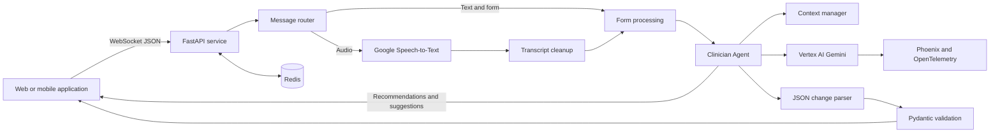
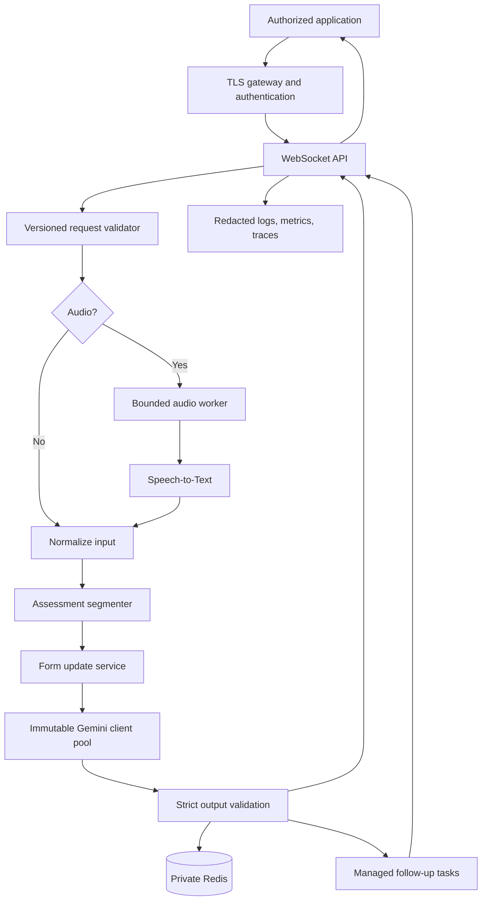

# Clinician Agent — Complete Project Documentation

**Application:** Python FastAPI WebSocket service  
**Purpose:** Convert clinical speech or text into structured physiotherapy and strength-and-conditioning assessment data

---

## 1. Project overview

The Clinician Agent accepts typed notes or recorded audio, converts audio into text when required, interprets the clinical information with Google Vertex AI Gemini, and returns an updated assessment form.

The intended information includes:

- Exercise plans, advice, and comments
- Sets, repetitions, loads, units, and durations
- Objective assessment results
- Subjective patient feedback
- Rate of Perceived Exertion (RPE)
- Suggestions and real-time recommendations

The main interface is a persistent WebSocket connection. Redis supports history, caching, rate limiting, session storage, and a small exercise dataset. Google Cloud Speech-to-Text handles transcription. Phoenix and OpenTelemetry provide LLM tracing.

The current implementation is not a RAG system. Retrieval-Augmented Generation and ChromaDB were removed. Some names, comments, constants, and tests still refer to them, but the active retrieval functions return no data. MongoDB, Whisper, and VAD are also not used by the current code.

### Current technology summary

| Area | Current implementation |
|---|---|
| API framework | FastAPI |
| Main transport | WebSocket `/ws` |
| HTTP endpoints | `/health`, `/stats`, `/debug/context` |
| Speech recognition | Google Cloud Speech-to-Text |
| Fast LLM | `gemini-2.0-flash-lite` |
| Primary LLM | `gemini-2.5-flash` |
| Fallback LLM | `gemini-2.5-pro` |
| Operational database | Redis |
| Validation | Pydantic |
| Observability | Phoenix, OpenTelemetry, logs |
| Runtime | Docker Compose; Python 3.12 containers |

### Major active limitation

Assessment segmentation is disabled. Every form-fill input is currently assigned to plan processing; objective, subjective, and RPE segments are assigned empty strings. Those processors exist but are not reached through the normal form-fill flow.

---

## 2. Architecture



### Component responsibilities

| Component | Responsibility |
|---|---|
| FastAPI application | Connections, message routing, responses, monitoring endpoints |
| Audio processor | Base64 decoding, audio normalization, speech requests |
| Transcript cleaner | Filler removal and a small known-term correction table |
| Clinician Agent | Prompts, Gemini calls, form updates, validation, follow-ups |
| LLM manager | Vertex initialization, model routing, fallback, tracing |
| Segmentation utilities | Parse change operations and update nested form fields |
| Context manager | Allocate and enforce prompt token budgets |
| Redis handler | Timestamped chat history |
| Redis services | Cache, rate limiter, sessions, exercises, vector-search placeholder |
| Phoenix/OpenTelemetry | LLM spans, prompt and model metadata, token usage |

---

## 3. Repository map

### Active files

| Path | Purpose |
|---|---|
| `main.py` | Entry point, WebSocket protocol, speech processing, health and statistics |
| `src/llm/functionalities.py` | Active `ClinicianAgent` and clinical processing |
| `src/llm/llm_manager.py` | Gemini models, routing, fallback, tracing |
| `src/llm/utils.py` | LLM registration and removed-RAG compatibility stubs |
| `src/llm/segmentations.py` | Change parsing and nested form modification |
| `src/prompts.py` | Active prompts |
| `src/context_manager.py` | Token estimation, prioritization, truncation, statistics |
| `src/redis_handler.py` | Redis connection and chat-history operations |
| `src/redis_services.py` | Cache, limits, sessions, exercise data, vector placeholder |
| `src/schemas/validation.py` | Pydantic form models |
| `requirements.txt` | Python dependencies |
| `Dockerfile.local` | Smaller local image |
| `Dockerfile` | Larger production-style image |
| `docker-compose-local.yml` | Local stack on backend port 9080 |
| `docker-compose-dev.yml` | Development stack on backend port 9080 |
| `docker-compose.yml` | Main stack on port 8080 with RedisInsight |

### Samples and historical data

| Path | Condition |
|---|---|
| `websocket_request.json` | Mixed historical request/response examples |
| `full_form.json` | Example form |
| `new_schema_testing.json`, `new_new_schema_testing.json` | Schema fixtures |
| `schema_map.json` | Schema mapping data |
| `schema.json` | Not valid JSON: contains comments and two top-level objects |

### Legacy and duplicate code

- `src/llm/old_functionalities.py`
- `src/llm/old_2_functionalities.py`
- `src/old_prompts.py`
- `src/old_2_prompts.py`
- Root-level `functionalities.py`; active code imports `src/llm/functionalities.py`
- Historical logs and result JSON files in `socket_testing/`

---

## 4. Startup lifecycle

Initialization occurs during Python module import:

1. Load `.env`.
2. Resolve the Vertex AI project and region.
3. Initialize Google Cloud AI Platform.
4. Register Phoenix/OpenTelemetry tracing.
5. Create and register the shared LLM manager.
6. Create a context manager with a 3,500-token limit.
7. Configure FastAPI and CORS.
8. Attempt Redis connection with exponential backoff.
9. Initialize Redis services when connected.
10. Create one global `ClinicianAgent`.
11. Start Uvicorn on container port 8080.

Missing Vertex configuration raises an exception during import, before FastAPI can expose diagnostics. Redis failure instead produces a limited-functionality state.

---

## 5. WebSocket protocol

**Endpoint:** `/ws`  
**Local transport:** `ws://`  
**Production transport:** `wss://` behind TLS infrastructure  
**Format:** JSON in WebSocket text frames

Binary WebSocket audio frames are not supported. Audio must be base64 inside JSON.

### Identity

The Redis/session identifier is direct concatenation of:

```text
userId + appointmentId/AppointmentId + formKey
```

No separator, validation, or hashing is used.

### Authentication acknowledgement

```json
{"payloadType": "authentication"}
```

returns:

```json
{"type": "authenticated"}
```

This does not authenticate a token or identity. The application assumes external infrastructure handles authentication.

### Ping/pong

Client ping `{ "type": "ping" }` receives `{ "type": "pong" }`.

Every 60 seconds the server sends:

```json
{"type": "server_ping", "timestamp": 0, "ping_number": 1}
```

The expected reply is `{ "type": "server_pong" }`. The receive loop uses a 300-second timeout and resumes waiting after timeout.

### Audio-only request

```json
{
  "userId": "user-123",
  "appointmentId": "appointment-456",
  "formKey": "assessment",
  "mode": "transcribe_only",
  "storeInChat": false,
  "audio": "data:audio/wav;base64,..."
}
```

Response:

```json
{"payloadType": "transcription", "transcription": "Corrected text"}
```

### Text and form request

```json
{
  "userId": "user-123",
  "appointmentId": "appointment-456",
  "formKey": "assessment",
  "mode": "form_fill",
  "text": "Add squats for three sets of ten repetitions",
  "formData": {
    "plan": {"advice": "", "plans": []},
    "objectiveAssessment": {"tests": []},
    "subjectiveAssessment": {"assessment": ""},
    "rpe": {"value": 0}
  }
}
```

Response sequence:

1. `{ "payloadType": "structured", "formData": {...} }`
2. `{ "payloadType": "structured", "realTimeRecommendations": "..." }`
3. `{ "payloadType": "structured", "suggestions": "..." }`

The form is returned first. Follow-ups run in an untracked background task and may be lost after disconnection or restart.

### Audio and form request

The request contains both `audio` and `formData`, with a mode other than `transcribe_only`. Responses are transcription, form, recommendations, then suggestions. Unlike the text path, this path bypasses Redis rate limiting, form-result caching, and session-state saving.

### Errors

Valid JSON with an unsupported shape returns `{ "error": "Unknown payload format" }`. Invalid JSON or unexpected exceptions normally break the connection loop. Incoming WebSocket payloads have no Pydantic request model.

---

## 6. HTTP endpoints

| Method | Endpoint | Purpose | Application access control |
|---|---|---|---|
| `GET` | `/health` | Component state and agent statistics | None |
| `GET` | `/stats` | Context, cache, limiter, exercise, and vector statistics | None |
| `POST` | `/debug/context` | Returns optimized prompt context for supplied data | None |

`/health` considers Redis healthy when the handler object exists; it does not ping the live client. It can therefore return HTTP 200 when Redis is unavailable. Its description still mentions removed ChromaDB checks.

---

## 7. Audio pipeline

1. Remove an optional data-URL prefix.
2. Base64-decode the payload.
3. Load it through `pydub` and FFmpeg.
4. Convert it to mono, 16 kHz, 16-bit WAV.
5. Use Google Speech recognition with `en-US` and automatic punctuation.
6. For audio up to 55 seconds, make one synchronous request.
7. For longer audio, split into 55-second chunks and use up to four threads.
8. Join transcript results in chunk order.
9. Remove fillers such as “uh”, “um”, “ah”, “er”, and “hmm”.
10. Apply a small hardcoded domain correction table.
11. Return corrected transcription.

The function states that five minutes is supported, but no five-minute limit or maximum payload size is enforced. Audio decoding and the top-level speech call are synchronous inside the async WebSocket handler, so transcription can block the event loop.

---

## 8. Form-processing pipeline

### Text fast path

1. Enforce a Redis limit of 30 requests per 60 seconds.
2. Look for a cached result using transcript plus form-state hash.
3. On a hit, return the cached form immediately.
4. On a miss, store the text in Redis chat history.
5. Run `ClinicianAgent.main_processor` in `form_only` mode on a worker thread.
6. Parse the returned JSON, falling back to the original form if parsing fails.
7. Cache the LLM response for one hour.
8. Save form state for 24 hours.
9. Return the form.
10. Generate recommendations and suggestions in the background.

### Schema repair

Before processing, selected older shapes are repaired:

- `subjectiveAssessments` becomes `subjectiveAssessment`.
- A subjective string becomes `{ "assessment": "..." }`.
- Numeric RPE becomes `{ "value": number }`.
- `objectiveAssessments` becomes `objectiveAssessment`.
- An objective list becomes `{ "tests": [...] }`.

Plan variants such as `exerciseName` versus `exercise`, or `sets` versus `set`, are not generally migrated.

### Active segmentation

The intended segments are plan, objective, and combined subjective/RPE. The LLM segregation call is commented out. Current assignment is:

```json
{
  "planTranscriptionSegment": "complete user input",
  "objectiveAssessmentsTranscriptionSegment": "",
  "subjectiveAssessmentAndRpeTranscriptionSegment": ""
}
```

The normal flow therefore updates plan information only. Existing non-plan fields may still be normalized and validated.

### Model selection

Complexity is scored using regular expressions and word count. Signals include multiple exercises, “then”, “also”, “next”, isometric holds, bilateral instructions, edit/delete commands, different set values, and longer input. Two or more signals select `gemini-2.5-flash`; otherwise `gemini-2.0-flash-lite` is used. Fast-model failure falls back to the primary model. General completion can fall back to `gemini-2.5-pro` when the primary is unavailable.

### Form changes

Gemini is prompted to return JSON change operations. Utilities support update, append, clear, remove, and replace actions on nested paths. The code extracts JSON, parses changes, removes an incorrect `plan.` prefix when present, and applies changes to the submitted plan.

### Validation

Individual sections and the complete form are validated with Pydantic. Validation helpers catch exceptions and return the original invalid data, so validation currently records errors but does not guarantee valid outgoing forms.

### Follow-ups

Recommendations use the filled form. Suggestions use the original transcript and current form with optimized context. Recommendations request RAG context, but retrieval returns an empty list.

---

## 9. Active form schema

```json
{
  "plan": {
    "advice": "string or null",
    "plans": [{
      "exercise": "required string",
      "set": [{"repetitions": 0, "load": "string or null", "unit": "string or null"}],
      "duration": {"value": 0, "unit": "string or null"},
      "comments": "string or null"
    }]
  },
  "objectiveAssessment": {
    "tests": [{
      "testName": "required string",
      "unitName": "required string",
      "value": 0,
      "left": 0,
      "right": 0,
      "comments": "string or null"
    }]
  },
  "subjectiveAssessment": {"assessment": "string or null"},
  "rpe": {"value": 0}
}
```

Rules and limitations:

- Top-level sections are optional.
- Exercise name, objective test name, and objective unit name are required when records exist.
- Objective values are integers, which prevents reliable decimal measurements.
- RPE is intended to be an integer from 0 to 10.
- `None` values are omitted from validated output.
- Samples use conflicting names: `exercise`/`exerciseName`, `set`/`sets`, `unitName`/`unit`, `left`/`leftValue`, and structured/numeric RPE.
- No API schema version is enforced at the WebSocket boundary.

---

## 10. Redis design

| Feature | Key/behavior | Expiry | Active limitation |
|---|---|---:|---|
| Chat history | Raw composite user ID; Redis list of timestamped messages | None | Unbounded and un-namespaced |
| Form cache | `cache:formfill:{hash}` | 1 hour | Text path only; metrics are process-local |
| Rate limiter | `ratelimit:{user_id}`; 30/60 seconds | 60 seconds | Fixed window, not token bucket; fails open; text path only |
| Session form | `session:{user_id}:form` | 24 hours | Saved but not restored or cleared in normal flow |
| Exercises | `exercise:{name}` | None | Seeded and searchable but unused in active form processing |
| Vector search | `doc:` scaffolding | Varies | Placeholder, not active retrieval |

The agent fetches Redis chat history and uses the last 20 entries. Main Compose enables append-only persistence and snapshots. RedisInsight provides a browser interface.

---

## 11. Context management

The maximum context is 3,500 estimated tokens. Allocation is:

| Content | Allocation |
|---|---:|
| Current input | 25% |
| Form schema | 15% |
| Recent chat | 20% |
| RAG context | 35% |
| System overhead | 5% |

Tokens are estimated as approximately one per three characters, although a comment states 3.5. Current input and form schema receive critical priority. Content is truncated at sentence boundaries when possible, followed by emergency character truncation. Statistics reset on restart. The 35% RAG allocation has no active retrieved content.

---

## 12. Logging and observability

Application logs include user identifiers, raw and corrected transcriptions, forms, LLM output, parsed changes, prompts-related metadata, and errors. Phoenix spans include model, project, region, temperature, limits, prompt length, full prompt text, and token usage when available.

Clinical and identifying information can therefore enter logs and traces. Access, encryption, redaction, retention, and deletion are not defined in application code. `/stats` and `/debug/context` also expose internal information without application-level authorization.

---

## 13. Configuration

### Variables used by Python

| Variable | Default | Purpose |
|---|---|---|
| `GOOGLE_APPLICATION_CREDENTIALS` | None | Service-account JSON path |
| `VERTEXAI_PROJECT` | Derived if possible | Google Cloud project |
| `VERTEXAI_LOCATION` | `us-central1` | Vertex region |
| `PHOENIX_PROJECT_NAME` | `vertex-llm-tracing` | Trace project |
| `OTEL_EXPORTER_OTLP_TRACES_ENDPOINT` | `http://localhost:6006/v1/traces` | Trace endpoint |
| `REDIS_HOST` | `localhost` | Redis host |
| `REDIS_PORT` | `6379` | Redis port |
| `REDIS_DB` | `0` | Redis database |
| `REDIS_MAX_RETRIES` | `5` | Connection attempts |
| `REDIS_INITIAL_BACKOFF` | `1.0` | Initial retry delay |
| `PORT` | `8080` | Port when running `python main.py` |

Compose also supplies variables not applied by current application logic: `GEMINI_LLM_SERVICE_CREDENTIALS`, `FRONTEND_ORIGINS`, `ENABLE_FULL_LOGGING`, `LOG_TRUNCATE_LENGTH`, and `LOGGING_LEVEL`. CORS remains hardcoded to `*`.

Expected local secret layout:

```text
project-root/
├── .env
└── config/
    └── combined_key.json
```

Both are excluded from Git. `.env` must exist because all Compose files reference it.

---

## 14. Containers and deployment

### Main stack

```bash
docker compose up -d --build
```

| Service | Host port |
|---|---:|
| Backend | 8080 |
| Redis | 6379 |
| RedisInsight | 8001 |
| Phoenix | 6006 |

Main Redis mounts two specific snapshot paths that are absent from the current checkout, making startup environment-dependent.

### Local stack

```bash
docker compose -f docker-compose-local.yml up -d --build
```

| Service | Host port |
|---|---:|
| Backend | 9080 |
| Redis | 6380 |
| Phoenix | 6007 |

Health is available at `http://localhost:9080/health`. The local stack uses the smaller `Dockerfile.local`.

### Docker image debt

The main Dockerfile additionally installs Google Cloud CLI and PyTorch and attempts to prefetch a BGE model with `sentence_transformers`. Current requirements do not include `sentence-transformers`, RAG is removed, and the prefetch is allowed to fail. These steps increase build time and size without serving the active runtime.

### Deployment scripts

`deploy.sh` and `revert.sh` stream fixed branches to a fixed EC2 host and rebuild the backend. They contain personal key paths, hostnames, directories, and branch names, so they are not portable.

---

## 15. Testing

| Script | Coverage |
|---|---|
| `ping_test_local.py` | Form processing and ping |
| `ptd_local_docker.py` | Health, connectivity, ping, form, stability, connections |
| `ptd_aws.py` | Deployment, form, audio, stability, concurrency |
| `form_quality_inspector.py` | Form-output quality inspection |
| `simplified_stress_test.py` | Health, errors, load |
| `comprehensive_testing.py` | Lifecycle, malformed input, payloads, concurrency, latency, throughput, audio |
| `quick_diagnosis_test.py` | Stale LLM/RAG diagnostics |

Most scripts default to port 8080; local Compose uses 9080. `quick_diagnosis_test.py` imports removed `try_init_rag` and cannot represent the current architecture. The repository has integration scripts but no maintained conventional unit-test suite or CI configuration.

Assessment verification:

- Python syntax compilation passed for application and test files.
- Compose validation stopped because `.env` is absent.
- Google credential configuration is absent.
- No live Redis, Speech, Vertex, Phoenix, WebSocket, form-quality, or load test was run.

Missing automated coverage includes schema migrations, every form-change action, mixed assessment routing, mocked external services, authorization, privacy/redaction, deterministic WebSocket contracts, and CI regression checks.

---

## 16. Issues and risks

### Critical

1. **Assessment segmentation is disabled.** Non-plan input can be ignored, misrouted, or left unchanged.
2. **Application authentication is absent.** Authentication messages are blindly acknowledged and HTTP diagnostics are open.
3. **Clinical data is logged and traced in full.** Prompts, transcripts, identifiers, forms, and responses can be retained across systems.
4. **Shared model mutation is concurrency-unsafe.** The singleton LLM temporarily changes its model while multiple worker-thread calls can overlap.

### High

1. Redis health can be reported as successful while disconnected.
2. Speech processing blocks the async event loop.
3. Audio and text form paths have different rate-limit, cache, and session behavior.
4. Concatenated identifiers can collide; missing fields can produce an empty shared identifier.
5. Validation fails open and can return invalid form data.
6. Follow-up tasks are untracked and can be lost or write to closed sockets.
7. WebSocket inputs and base64 audio have no structured validation or size limit.
8. Missing AI configuration fails during import before diagnostics become available.
9. Chat history has no TTL or length bound.

### Medium

1. Conflicting form schemas exist across samples, prompts, and validators.
2. Exercise data is initialized but unused in the active pipeline.
3. Session state is saved but not restored or cleared.
4. Vector search is only a placeholder.
5. RAG/ChromaDB terminology remains throughout code, tests, statistics, and docs.
6. The limiter is fixed-window despite being described as token bucket, and it fails open.
7. CORS ignores `FRONTEND_ORIGINS` and uses wildcard origins with credentials enabled.
8. Redis, RedisInsight, Phoenix, statistics, and debug endpoints are exposed by default.
9. The main image contains unnecessary removed-RAG build steps.
10. Main Compose references missing snapshot files.
11. Metrics reset on restart.
12. The stated five-minute audio limit is not enforced.
13. Objective values only accept integers, limiting decimal clinical measurements.
14. `FAST_MAX_OUTPUT_TOKENS` is defined but not applied to routed fast-model calls.
15. Recommendations receive no retrieved clinical references despite requesting RAG context.

### Maintainability debt

1. Active functionality and prompt files are very large and contain extensive commented versions.
2. Multiple complete legacy implementations remain beside active code.
3. Existing documents describe removed MongoDB, Whisper, VAD, RAG, and ChromaDB behavior.
4. `schema.json` is invalid JSON.
5. Deployment settings are hardcoded.
6. `src/constants.py` retains unused BGE and ChromaDB configuration.
7. Comments contradict active code in several areas.

---

## 17. Legacy and unwanted elements

Strong cleanup candidates, after confirming no external imports:

- Both `old_functionalities.py` files
- Both old prompt files
- Root-level duplicate `functionalities.py`
- Large commented implementations inside active files
- RAG and ChromaDB constants and compatibility functions
- RAG-dependent diagnosis cases
- Redis vector placeholder if retrieval is not planned
- Historical test logs and result JSON files
- Disabled audio-saving blocks
- PyTorch, BGE prefetch, and Google CLI production-image steps when not required

Decision-required elements:

- Connect the exercise database to form processing or remove it.
- Implement session restoration and completion cleanup or remove resumable-session claims.
- Implement defined vector retrieval or remove the placeholder.
- Define safety and output contracts for recommendations and suggestions.
- Restrict `/debug/context` to protected non-production use or remove it.

Git history should preserve previous implementations instead of keeping full commented and duplicate versions in active source files.

---

## 18. Optimization roadmap

### Phase 1 — Correctness, privacy, and access

1. Restore assessment segmentation with mixed plan/objective/subjective/RPE tests.
2. Establish one versioned form schema and validate every request and response.
3. Reject invalid generated output instead of returning it.
4. Add token authentication and tenant/user authorization.
5. Redact logs and traces; disable full-prompt capture by default.
6. Replace concatenated IDs with namespaced delimiter-safe or hashed keys.
7. Add byte, duration, type, and timeout limits.
8. Replace shared mutable LLM state with immutable model clients.

### Phase 2 — Reliability

1. Move blocking audio work to a bounded executor or job worker.
2. Use one shared post-transcription pipeline for text and audio.
3. Separate liveness and readiness and check live dependencies.
4. Track background tasks and attach request IDs to all responses.
5. Define stable structured errors and error codes.
6. Add chat TTL, maximum list length, and session cleanup.
7. Restore saved sessions where required.
8. Add bounded retries and timeouts for Google services.

### Phase 3 — Maintainability and tests

1. Split API, speech, form, LLM, storage, schema, and observability modules.
2. Remove legacy and commented copies.
3. Replace wildcard prompt imports with explicit imports.
4. Inject Redis, Speech, LLM, and tracing dependencies.
5. Add unit and mocked contract tests.
6. Add CI for formatting, linting, types, tests, secrets, and builds.
7. Update every sample to the canonical schema.

### Phase 4 — Performance and cost

1. Measure audio, speech, form, recommendation, and suggestion latency separately.
2. Apply model-specific token limits and timeouts.
3. Cache only validated versioned output.
4. Use a multi-stage image and remove unused heavy packages.
5. Parallelize independent follow-ups with controlled task ownership.
6. Use asynchronous long-audio jobs with progress events.
7. Replace character token estimates with a calibrated model tokenizer.
8. Include chat history only where measured quality improves.

### Phase 5 — Operations

1. Parameterize deployment settings.
2. Use a managed secret store.
3. Keep Redis and observability endpoints private.
4. Add durable latency, error, dependency, cache, and token dashboards.
5. Define backup, restore, retention, and disaster recovery.
6. Add image pinning, vulnerability scans, and a software bill of materials.

---

## 19. Recommended target architecture



Target principles:

- Authenticate before accepting clinical data.
- Require one explicit schema version.
- Share one processing pipeline after transcription.
- Strictly validate model output.
- Avoid shared mutable request state.
- Exclude personal and health information from default logs.
- Keep data and observability services private.
- Manage follow-up task lifecycle explicitly.
- Separate extracted facts from generated recommendations.

### Recommended response envelope

```json
{
  "requestId": "uuid",
  "status": "completed",
  "stage": "form",
  "schemaVersion": "1.0",
  "data": {"formData": {}},
  "errors": []
}
```

Useful stages are `accepted`, `transcription`, `form`, `recommendations`, `suggestions`, `completed`, and `failed`.

---

## 20. Data lifecycle

| Data | Processing | Storage | Current retention |
|---|---|---|---|
| Audio | Decoded and sent to Google Speech | Not intentionally stored by active code | Request lifetime, plus external service policy |
| Transcript | Cleaned and added to prompts | Redis chat in selected flows | No TTL |
| Input form | Repaired and sent for processing | Cache/session on text path | 1 hour/24 hours |
| Output form | Updated and validation attempted | Cache/session on text path | 1 hour/24 hours |
| Prompts/responses | LLM calls and tracing | Logs and Phoenix | Undefined in code |
| Exercise data | Seeded on initialization | Redis `exercise:` keys | No TTL |
| Statistics | Aggregated in process | Mainly memory | Until restart |

Google Cloud and Phoenix retention must be controlled through service and organizational policy.

---

## 21. Required production controls

- Verified identity and authorization for every connection
- TLS for external traffic
- Private Redis and observability networks
- Managed secrets and least-privilege Google credentials
- Limits and rate controls on every path
- Redacted logs, traces, and audit events
- Defined retention and deletion
- Human confirmation before final clinical-record submission
- Clear distinction between extracted facts and AI recommendations
- Versioned prompts, schemas, and models
- De-identified clinical regression evaluation
- Monitoring for missing fields, invented values, and unit errors
- A failure state that preserves the original form and clearly reports the problem
- Incident processes for exposure, incorrect output, and service outages

---

## 22. Final assessment

The project has a clear core: real-time WebSocket communication, Google speech recognition, Gemini-based form updates, Redis-backed performance features, validation, and observability. Removing the older RAG stack simplified startup and reduced expected memory, image size, and latency.

The repository remains transitional. The highest priorities are restoring correct assessment routing, protecting clinical information, implementing access control, removing shared LLM mutation, enforcing one form contract, aligning text and audio paths, and making validation strict. After those controls, legacy implementations, obsolete RAG elements, unused services, duplicated flows, and heavy image dependencies can be removed safely.

A versioned protocol, deterministic tests, privacy-safe observability, and modular service boundaries provide the foundation for reliable operation and future optimization.
