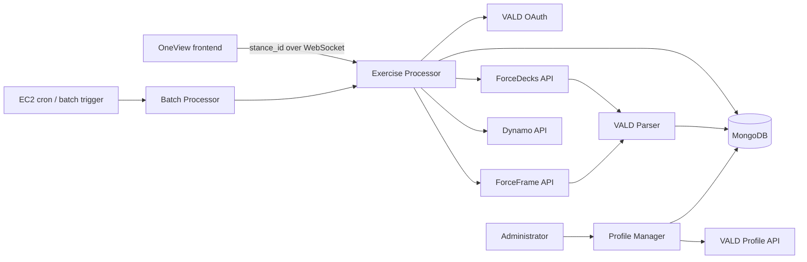

# OneView VALD Backend — Complete Project Brief

## 1. Purpose

This project connects a Stance patient with their VALD athlete profile and brings
physical-testing results from multiple VALD products into one consistent format.

It performs four main jobs:

1. Resolves a Stance patient ID to a VALD profile ID.
2. Fetches new ForceDecks, ForceFrame, and Dynamo results from VALD APIs.
3. Converts the device-specific responses into frontend-ready exercises, sessions,
   metrics, percentage changes, asymmetry values, and graph data.
4. Saves the processed response and synchronization state in MongoDB.

The intended result is one patient view where a practitioner can see historical
physical-performance results without calling each VALD product separately.

## 2. High-level architecture



## 3. Main components

| Component | Main file | Responsibility |
|---|---|---|
| Exercise Processor | `update_vald_exercises_app.py` | WebSocket request, patient lookup, VALD fetch, parse, cache, response, and diagnostics |
| Fetch Coordinator | `src/file_handling/data_updater.py` | Calls all supported VALD product APIs and determines whether results are new |
| VALD Clients | `src/VALD/src/fetch/vald_fetch/src/` | Product-specific requests for ForceDecks, ForceFrame, and Dynamo |
| Parser | `src/parsers/vald_api_parser.py` | Converts raw device responses into the OneView frontend structure |
| Mongo Repository | `src/file_handling/vald_exercise_db.py` | Reads mappings, stores processed data, and updates the synchronization watermark |
| Profile Manager | `vald-profile-functions/` | Searches, links, unlinks, and repairs Stance-to-VALD profile associations |
| Batch Processor | `batch_reprocess_vald.py` | Synchronizes all eligible patients using six resumable worker processes |

## 4. Online request flow

The frontend connects to:

```text
WebSocket /ws
```

and sends one JSON message:

```json
{
  "stance_id": "<stance-patient-id>"
}
```

The backend then follows this sequence:

1. Find the MongoDB document whose `stanceId` matches the request.
2. Read `associatedValdId[0]` as the VALD athlete/profile ID.
3. Load the existing processed response from `savedResponse.data`.
4. Load `lastRecordedUtc`, which is used as the VALD incremental-fetch watermark.
5. Obtain or reuse a VALD OAuth access token.
6. Request newer data from Dynamo, ForceDecks, and ForceFrame.
7. Parse ForceDecks and ForceFrame into the frontend structure.
8. Store the processed data in MongoDB.
9. Set `lastRecordedUtc` to the latest timestamp found in the fetched results.
10. Return the new data. If no new data is detected, return the cached response.

The WebSocket handles one request per connection; it is not a continuous event
stream.

## 5. VALD product integrations

### ForceDecks

ForceDecks supplies force-platform tests such as jumps, squats, balance tests, and
isometric assessments.

The integration:

1. Retrieves the tenant's VALD profiles.
2. Confirms that the requested profile exists.
3. Fetches tests modified after the supplied timestamp.
4. Requests trial details separately for every test.
5. Attaches the trials to their parent tests before parsing.

### ForceFrame

ForceFrame supplies strength tests with left/right and outer/inner measurements.

The integration:

1. Fetches tests modified after the supplied timestamp.
2. Calls an additional metrics endpoint for every test.
3. Keeps non-null metric fields matching outer/inner and left/right patterns.
4. Treats all-zero inner-sensor measurements as not measured.

### Dynamo

Dynamo supplies dynamometry tests, repetition summaries, and repetitions.

Dynamo is currently fetched and included in new-data and timestamp decisions, but
the top-level parser does not transform it into the frontend response. This is an
incomplete part of the current implementation.

## 6. Parser behavior

The parser transforms raw VALD data into exercises containing chronological
sessions, normalized metrics, and graph-ready arrays.

### ForceDecks transformation

- Maps codes such as `CMJ` to readable names such as `Counter Movement Jump`.
- Converts metric identifiers from `UPPER_SNAKE_CASE` to `camelCase`.
- Groups tests by exercise.
- Orders sessions oldest first.
- Handles left, right, bilateral, trial, and asymmetry results.
- Uses the largest absolute value when repeated values exist in one session.
- Calculates percentage change against the previous session.
- Calculates asymmetry when supported and not supplied by VALD.

### ForceFrame transformation

- Combines test name and test position into an exercise name.
- Discovers metric fields dynamically rather than relying on a fixed list.
- Builds left/right session arrays and percentage changes.
- Infers units from metric names.
- Produces asymmetry and graph summaries.
- Splits supported dual movements, such as hip abduction/adduction, into named
  movement sections and calculates inner-to-outer ratios.

The approximate asymmetry calculation is:

```text
abs(left - right) / max(left, right) * 100
```

The approximate percentage-change calculation is:

```text
(current - previous) / previous * 100
```

## 7. Processed response shape

The response is organized by device, exercise, session, and metric:

```json
{
  "forceDeck": {
    "Counter Movement Jump": {
      "sessionDates": ["2026-01-01 10:00:00", "2026-02-01 10:00:00"],
      "data": {
        "exampleMetric": [
          {"left": 100, "right": 105},
          {
            "left": 110,
            "right": 112,
            "percentChange": {"left": 10, "right": 6.67}
          }
        ]
      },
      "graph": {}
    }
  },
  "forceFrame": {},
  "is_forcedeck": true,
  "is_forceframe": false,
  "is_dynamo": false
}
```

Graph types can be configured by CSV files expected under `metric-pool/`. Those
files are absent from this checkout, so the parser currently uses fallback graph
types.

## 8. MongoDB model

The active data location is:

```text
Database: stance-dashboard
Collection: vald-exercise-data
```

A simplified document is:

```json
{
  "stanceId": "<stance-id>",
  "stanceFullName": "Patient Name",
  "valdFullName": "VALD Profile Name",
  "associatedValdId": ["<vald-profile-id>"],
  "valdSyncId": "<stance-id>",
  "lastRecordedUtc": "<MongoDB date>",
  "savedResponse": {
    "data": {
      "forceDeck": {},
      "forceFrame": {},
      "dynamo": {},
      "is_forcedeck": true,
      "is_forceframe": true,
      "is_dynamo": false
    }
  },
  "createdAt": 0,
  "updatedAt": 0
}
```

The document combines identity mapping, synchronization state, and cached frontend
data. Although `associatedValdId` is an array, the exercise processor uses only its
first element.

## 9. Profile Manager

The Profile Manager is a separate FastAPI application with a static browser UI. It
supports:

- Searching Stance patients by ID or name.
- Searching and reading VALD profiles.
- Linking a patient to a VALD profile.
- Unlinking an incorrect association.
- Finding VALD profiles with missing sync IDs.
- Setting the Stance ID as the VALD `syncId` and `externalId`.

VALD and MongoDB updates are separate operations. They are not one transaction, so
partial success is possible and must be handled operationally.

## 10. Batch synchronization

`batch_reprocess_vald.py` refreshes all MongoDB patients with an associated VALD
profile. It:

- Splits patients into six chunks.
- Runs six worker processes.
- Stores per-chunk progress and results under `temporary/`.
- Resumes previously interrupted chunks.
- Writes completion information to a cron log.

The repository contains EC2 cron and Lambda/SSM scheduling artifacts. The active
production scheduler must be confirmed with the system owner.

## 11. Runtime configuration

Important environment variables include:

```text
MONGO_URI
VALD_CLIENT_ID
VALD_CLIENT_SECRET
VALD_TENANT_ID
WORKSPACE_ROOT
PROFILES_DIR
```

The apparent current server entry point is:

```bash
python -m uvicorn update_vald_exercises_app:app --host 0.0.0.0 --port 8091
```

The Dockerfile and Docker Compose file reference older modules that are not present
in this checkout. The authoritative deployment configuration should therefore be
confirmed before using them.

## 12. Important current risks

### Data correctness

1. **Historical session replacement:** Incremental fetches return only recently
   modified tests, but saving replaces the complete non-empty device section. This
   can remove previously cached exercises and sessions.
2. **One shared watermark:** Dynamo, ForceDecks, and ForceFrame use the same
   `lastRecordedUtc`. A newer result from one device can cause older-but-unfetched
   results from another device to be skipped.
3. **Incomplete Dynamo pipeline:** Dynamo can mark a request as new and advance the
   watermark even though it is not included in the parsed output.
4. **Failure versus no change:** Broad exception handling can convert an API or
   processing failure into an empty result, which is then reported as no new data.
5. **Partial online response:** After an incremental update, the WebSocket returns
   the newly parsed subset rather than the complete merged response from MongoDB.

### Security and operations

1. A MongoDB credential exists as a committed fallback and must be rotated and
   removed. Runtime configuration should be mandatory.
2. Debug, inspection, batch-stop, and Profile Manager operations have no visible
   authentication or authorization layer.
3. CORS is broadly enabled.
4. Several synchronous HTTP and MongoDB operations run inside an asynchronous
   WebSocket handler.
5. Some VALD requests have no explicit timeout, retry, or exponential backoff.
6. No automated tests are present in this checkout.

## 13. Recommended improvement order

1. Rotate the exposed MongoDB credential and remove the fallback from source.
2. Store separate watermarks for Dynamo, ForceDecks, and ForceFrame.
3. Merge tests and sessions by stable test ID instead of replacing device sections.
4. Fully implement Dynamo parsing or exclude Dynamo from synchronization decisions.
5. Return explicit outcomes for `updated`, `unchanged`, `partial_failure`, and
   `failed`.
6. Return the final merged MongoDB response after an update.
7. Protect administrative and diagnostic endpoints with authentication and roles.
8. Add unit and integration tests for parsing, merging, timestamps, and failures.
9. Add HTTP timeouts, retry policies, rate-limit handling, and observability.
10. Standardize the application entry point, port, Docker configuration, and
    deployment procedure.

## 14. Summary

The project has a strong overall integration concept: one Stance identity is mapped
to one VALD athlete profile, results are collected from several VALD products, and
raw measurements are converted into a consistent historical and graph-ready form.

The parser and administrative tooling provide useful foundations. The principal
work required before treating the data pipeline as fully reliable is correcting
incremental session merging, introducing per-device timestamps, completing the
Dynamo path, separating failures from unchanged data, and strengthening security
and automated testing.

For deeper code-backed documentation, continue with:

- `docs/01-business-overview.md`
- `docs/02-system-architecture.md`
- `docs/03-services-and-integrations.md`
- `docs/04-data-flow.md`
- `docs/15-open-questions.md`
