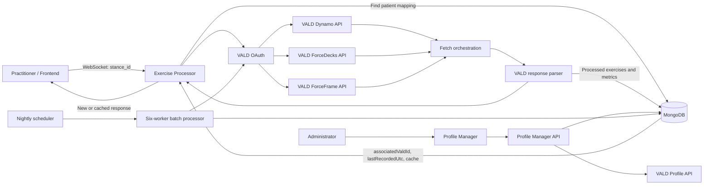

# OneView–VALD Codebase: Client Walkthrough and 30-Day Delivery Plan

**Prepared for:** Client walkthrough  
**Purpose:** Explain the current understanding of the OneView–VALD system, demonstrate technical and business awareness, and present a practical delivery plan for the next week and month.

---

## 1. Executive summary

OneView connects patient records in the Stance ecosystem with physical-performance test data from VALD.

VALD supplies measurements from products such as ForceDecks, ForceFrame, and Dynamo. The codebase retrieves those measurements, transforms device-specific API responses into a consistent frontend format, stores the processed result in MongoDB, and returns it to the consuming application.

The system also contains administrative workflows for maintaining the identity relationship between a Stance patient and a VALD profile. These workflows allow an operator to search, link, unlink, repair mismatches, and attach missing synchronization identifiers.

The current system can be understood as four connected capabilities:

1. **Patient identity mapping**
   - Connects a Stance patient ID to a VALD profile ID.

2. **Incremental exercise synchronization**
   - Retrieves tests that are newer than the last processed timestamp.

3. **Data transformation and caching**
   - Converts raw device results into exercises, sessions, metrics, changes, asymmetries, and graph data.

4. **Operational and administrative support**
   - Runs nightly batch synchronization and provides tools to correct profile associations.

My proposed first-month approach is to document and validate the existing behavior, create a testing and observability baseline, and then refactor the code in controlled stages. The objective is to improve clarity, security, reliability, and performance without unintentionally changing the business output.

---

## 2. A concise opening statement for the client meeting

The following can be used almost word-for-word:

> My current understanding is that OneView acts as an integration and presentation layer between Stance patient records and VALD performance data. A Stance patient is mapped to a VALD profile in MongoDB. When exercise data is requested, the system uses that mapping and the last successfully processed timestamp to retrieve newer ForceDecks, ForceFrame, and Dynamo tests from VALD.
>
> The raw VALD responses are device-specific, so the application transforms them into a common structure containing exercises, sessions, left and right values, bilateral values, asymmetry, percentage change, and frontend graph information. The processed result is cached in MongoDB and returned to the frontend. If there is no newer data, the existing cached result is returned.
>
> The repository also includes a profile-management application used to repair identity relationships between Stance and VALD, as well as a six-worker nightly batch process for refreshing all linked patients.
>
> During my initial review I have also found a mixture of current and legacy code paths, incomplete deployment configuration, limited automated testing, and several reliability and security improvements that should be addressed. My plan is to validate the business behavior first, establish documentation and tests, and then refactor in small, measurable changes.

---

## 3. Business problem being solved

### 3.1 The underlying problem

A practitioner may have a patient in the Stance system while that patient’s physical-performance measurements live across multiple VALD products.

Without an integration layer, users may need to:

- Find the correct athlete manually in VALD.
- Check multiple device-specific systems.
- Interpret different response formats.
- Compare measurements across sessions manually.
- Resolve duplicate or incorrectly linked profiles.
- Determine whether missing data means “no test” or “synchronization failed.”

OneView is intended to reduce that fragmentation.

### 3.2 Business value provided by the system

The current code appears designed to provide:

- A unified view of a patient’s VALD exercise information.
- Consistent data structures across different VALD devices.
- Faster responses through cached processed data.
- Incremental synchronization rather than repeatedly downloading all history.
- Trend information across multiple sessions.
- Left/right and asymmetry insights.
- Administrative correction of profile-linking problems.
- Automated nightly refreshes for all linked patients.

### 3.3 Current business interpretation to validate

My working interpretation is:

> Stance is the source of patient identity and application context. VALD is the source of performance measurements. MongoDB holds the relationship between those systems and caches the processed result used by OneView.

This should be explicitly validated with the client. In particular, confirm which system is authoritative for:

- Patient name.
- Date of birth.
- Sex.
- Patient activation status.
- Profile deletion.
- Profile merging.
- The patient-to-VALD association.

---

## 4. Terminology and domain glossary

### Stance ID

The application’s internal identifier for a patient. In code and MongoDB this is generally represented as:

```text
stanceId
```

Clients send this value to request a patient’s exercise data.

### VALD profile ID

The unique identifier assigned by VALD to an athlete profile.

MongoDB stores one or more of these in:

```text
associatedValdId
```

Most current code uses only the first value in this list.

### VALD sync ID

An external identifier stored on the VALD profile. The intended relationship appears to be:

```text
VALD syncId = Stance stanceId
```

This allows the two systems to identify the same person.

### VALD external ID

Another external identifier accepted by the VALD Profile API. The current profile-management code generally sets both `syncId` and `externalId` to the Stance ID.

### ForceDecks

A VALD product used for force-platform testing. Typical tests include:

- Counter Movement Jump.
- Squat Assessment.
- Drop Jump.
- Squat Jump.
- Isometric Mid-Thigh Pull.
- Single-leg tests.
- Balance and stability tests.

The API supplies tests, trials, metric definitions, limb information, and metric values.

### ForceFrame

A VALD product used for strength testing. The API returns test records with positions and dynamically named left/right, outer/inner metrics.

### Dynamo

A VALD dynamometry product. The current code fetches Dynamo tests and repetition summaries, although the primary response parser does not currently transform Dynamo data into the frontend result.

### `lastRecordedUtc`

A MongoDB timestamp used as an incremental synchronization watermark. It tells the VALD fetch functions where to begin looking for newer records.

### `savedResponse.data`

The processed frontend result stored in MongoDB. It acts as a cache and prevents the application from rebuilding old results unnecessarily.

### Parser

The code that turns raw VALD API responses into the exercise/session/metric format expected by OneView.

---

## 5. Current system architecture



### Primary technology choices

- **Language:** Python.
- **Web framework:** FastAPI.
- **Application server:** Uvicorn.
- **Primary client protocol:** WebSocket.
- **Database:** MongoDB.
- **External integration:** VALD REST APIs with OAuth client credentials.
- **Batch execution:** Python subprocess workers.
- **Production packaging:** Docker.
- **Scheduling:** EC2 cron and/or AWS Lambda with SSM Run Command.
- **Frontend administration tool:** Single-page HTML, CSS, and JavaScript.

---

## 6. Detailed runtime flow

### 6.1 Client request

The frontend opens a WebSocket connection to:

```text
/ws
```

It sends:

```json
{
  "stance_id": "patient-id"
}
```

The server waits up to 300 seconds for this message.

### 6.2 Patient lookup

The server queries:

```text
Database:   stance-dashboard
Collection: vald-exercise-data
Query:      { "stanceId": "<patient-id>" }
```

If the document does not exist, the server returns an error.

If the document exists, it reads:

- `associatedValdId`
- `stanceFullName`
- `valdFullName`
- `lastRecordedUtc`
- `savedResponse.data`

The first `associatedValdId` becomes the active VALD profile ID.

### 6.3 Incremental watermark

The database layer converts `lastRecordedUtc` into a timestamp used for all devices:

```json
{
  "dynamo": "2026-01-01T10:00:00Z",
  "forcedeck": "2026-01-01T10:00:00Z",
  "forceframe": "2026-01-01T10:00:00Z"
}
```

If the timestamp is absent, each device receives `"0"`. The fetch layer then uses its configured historical start date.

### 6.4 VALD authentication

The application uses OAuth client credentials:

```text
VALD_CLIENT_ID
VALD_CLIENT_SECRET
```

The token request uses the `vald-api-external` audience. Access tokens are cached in application memory and reused until shortly before expiration.

### 6.5 Dynamo retrieval

The Dynamo client:

- Requests tests for the VALD athlete ID.
- Requests tests modified after the current watermark.
- Requests repetition summaries and repetitions.
- Converts summaries into data-frame structures for older workflows.

The main synchronization function records whether Dynamo has newer data. However, the current main parser does not accept Dynamo as an input, which means its end-to-end production use needs clarification.

### 6.6 ForceDecks retrieval

The ForceDecks client:

1. Retrieves profiles for the configured tenant.
2. Checks that the requested VALD profile is present.
3. Requests tests modified after the watermark.
4. Retrieves the trials for each test.
5. Attaches trials to the relevant test.
6. Normalizes older and newer test/trial structures.

The trials are important because individual metrics and limb information are contained inside them.

### 6.7 ForceFrame retrieval

The ForceFrame client:

1. Requests tests for the patient and tenant.
2. Applies the modification watermark.
3. Retrieves an additional metric response for each test.
4. Includes dynamically named non-null metric fields.

Recognized metric names follow patterns such as:

```text
outerLeft...
outerRight...
innerLeft...
innerRight...
```

This dynamic behavior allows the parser to include new VALD metric fields without maintaining a fixed list.

### 6.8 New-data decision

For each device, the fetch layer identifies its newest returned timestamp and compares it with the stored timestamp.

A record is considered new only when it is more than one second newer. The one-second tolerance avoids repeatedly processing insignificant timestamp differences.

### 6.9 ForceDecks parsing

The parser groups ForceDecks tests by exercise.

Short VALD codes are mapped to readable names, for example:

| VALD code | OneView exercise name |
|---|---|
| `CMJ` | Counter Movement Jump |
| `SQT` | Squat Assessment |
| `DJ` | Drop Jump |
| `SJ` | Squat Jump |
| `IMTP` | Isometric Mid-Thigh Pull |

Raw metric names are converted from uppercase snake case to camel case:

```text
RSI_MODIFIED → rsiModified
MEAN_FORCE → meanForce
```

For every session, the parser:

- Reads trial-level and result-level limb data.
- Supports left, right, bilateral, trial, and asymmetry values.
- Selects the highest absolute value where multiple values exist.
- Calculates missing asymmetry when possible.
- Calculates percentage change against the previous session.
- Builds graph data aligned with session dates.

Sessions are sorted oldest-first so that trend calculations move forward in time.

### 6.10 ForceFrame parsing

ForceFrame records are grouped using test name and test position.

For example:

```text
testName:     Hip AD/AB
testPosition: Hip AD/AB - 45
```

becomes:

```text
Hip AD/AB - 45
```

The parser discovers available metrics dynamically. It then builds:

- Session dates.
- Per-session metric values.
- Left/right values.
- Percentage change.
- Graph structures.

Certain dual-movement exercises may be restructured into:

- Outer movement.
- Inner movement.
- Ratio.

The actual labels depend on the exercise, such as adduction and abduction.

### 6.11 Processed response

A simplified result looks like:

```json
{
  "forceDeck": {
    "Counter Movement Jump": {
      "sessionDates": [
        "2026-01-01 10:00:00",
        "2026-02-01 10:00:00"
      ],
      "data": {
        "rsiModified": [
          {
            "value": 1.1
          },
          {
            "value": 1.3,
            "percentChange": 18.18
          }
        ]
      },
      "graph": {}
    }
  },
  "forceFrame": {},
  "is_forcedeck": true,
  "is_forceframe": false
}
```

### 6.12 MongoDB update

The processed device sections are merged into `savedResponse.data`.

The merge is designed to avoid erasing existing device data when a new fetch returns only one device. For example, a ForceFrame-only update should not remove existing ForceDecks data.

After storage, the application finds the newest timestamp across the fetched devices and saves it as `lastRecordedUtc`.

### 6.13 Client response

For new data, the response includes:

- Processing success.
- The parsed data.
- `isNewData: true`.
- Stance ID.
- VALD profile ID.
- Patient name.

If no newer tests are found, the existing cached response is returned with:

```text
isNewData: false
```

---

## 7. MongoDB data model

A simplified document is:

```json
{
  "stanceId": "internal-patient-id",
  "stanceFullName": "Patient Name",
  "valdFullName": "Patient Name in VALD",
  "valdSyncId": "internal-patient-id",
  "associatedValdId": [
    "vald-profile-id"
  ],
  "lastRecordedUtc": "MongoDB ISODate",
  "savedResponse": {
    "data": {
      "forceDeck": {},
      "forceFrame": {},
      "dynamo": {},
      "is_forcedeck": true,
      "is_forceframe": true,
      "is_dynamo": false
    }
  },
  "createdAt": 1760000000000,
  "updatedAt": 1760000000000
}
```

### Fields requiring business validation

- Can `associatedValdId` legitimately contain multiple profile IDs?
- If yes, should data be combined across them?
- If no, why is it represented as a list?
- Is `valdSyncId` always expected to equal `stanceId`?
- Is `lastRecordedUtc` the time data was recorded, modified, or synchronized?
- Should each device maintain its own watermark?
- Is the cached response a permanent record or a rebuildable view?

---

## 8. Profile-management workflows

The repository includes a separate FastAPI application and browser interface for managing identity relationships.

### 8.1 Search

An operator can search by:

- Stance ID.
- Patient name.
- VALD profile ID.
- VALD sync ID.
- VALD external ID.

The application combines information from MongoDB and the live VALD Profile API.

### 8.2 Link

The intended link workflow is:

```text
Find Stance patient
    ↓
Select VALD profile
    ↓
Set Stance ID as VALD sync/external ID
    ↓
Save selected VALD profile ID in MongoDB
```

The operation changes both VALD and MongoDB.

### 8.3 Unlink

The intended unlink workflow is:

```text
Find current VALD profile
    ↓
Remove its VALD sync ID
    ↓
Remove the profile ID from the MongoDB patient record
    ↓
Set MongoDB valdSyncId to null
```

### 8.4 Fix mismatch

The browser UI guides an administrator through:

1. Loading the Stance patient.
2. Reviewing the current, incorrect VALD profile.
3. Selecting the correct VALD profile.
4. Unlinking the incorrect profile.
5. Linking the correct profile.

### 8.5 Attach missing sync IDs

The application:

1. Retrieves VALD profiles without a sync ID.
2. Cross-references them with `associatedValdId` in MongoDB.
3. Allows an administrator to attach the Stance ID as the VALD sync ID.

### 8.6 Important operational property

These are multi-system operations rather than database transactions. VALD may be updated successfully while MongoDB fails, or vice versa.

This creates a need for:

- Audit logging.
- Idempotent operations.
- Clear partial-failure reporting.
- A reconciliation workflow.
- Authentication and role-based access.

---

## 9. Nightly batch processing

The batch process refreshes all MongoDB patients that have at least one associated VALD profile ID.

### Batch workflow

1. Query eligible patients from MongoDB.
2. Divide them into six chunks.
3. Launch six worker processes.
4. Process each patient using the same fetch, parse, merge, and timestamp logic.
5. Save progress after every patient.
6. Write final results for each worker.
7. Aggregate the results into an operational log.

### Resume behavior

Each worker records:

- Completed patients.
- Patients with no new data.
- Failed patients and failure reasons.

If a worker is restarted, it skips previously recorded patients.

### Scheduling

The repository contains two scheduling approaches:

- An EC2 cron setup script.
- An AWS Lambda that invokes EC2 through SSM Run Command.

The authoritative production scheduler needs to be confirmed.

### Batch observability

The exercise service exposes a cron-status endpoint that reads:

- Historical run logs.
- Per-worker progress files.
- Per-worker result files.
- Current processed, successful, no-data, and failed counts.

---

## 10. Current repository map

```text
One-view/
├── update_vald_exercises_app.py
│   └── Current WebSocket exercise processor
│
├── batch_reprocess_vald.py
│   └── Six-worker bulk refresh
│
├── src/
│   ├── file_handling/
│   │   ├── vald_exercise_db.py
│   │   │   └── Current vald-exercise-data database wrapper
│   │   ├── data_updater.py
│   │   │   └── VALD fetch orchestration plus older helpers
│   │   └── mongodb_updater.py
│   │       └── Older matches-collection database path
│   │
│   ├── parsers/
│   │   └── vald_api_parser.py
│   │       └── ForceDecks and ForceFrame transformation
│   │
│   ├── utils/
│   │   ├── math_utils.py
│   │   │   └── Asymmetry and percentage-change calculations
│   │   └── logging_config.py
│   │       └── Logging configuration
│   │
│   └── VALD/src/fetch/vald_fetch/
│       ├── fetchvald.py
│       │   └── Older filesystem-based complete fetch
│       └── src/
│           ├── fetch_dynamo.py
│           ├── fetch_forcedeck.py
│           ├── fetch_forceframe.py
│           └── latest_fetch.py
│
├── vald-profile-functions/
│   ├── api.py
│   │   └── Profile Manager HTTP API
│   ├── index.html
│   │   └── Profile Manager browser UI
│   ├── main.py
│   │   └── Profile Manager command-line UI
│   ├── vald_client.py
│   │   └── VALD Profile API client
│   └── db_operations.py
│       └── Profile-link database operations
│
├── cleanup_zero_inner_metrics.py
├── reset_missing_forcedeck.py
├── reset_timestamps_to_2019.py
│   └── Maintenance and data-repair scripts
│
├── lambda_trigger_reprocess.py
├── setup_ec2_cron.sh
├── deploy_vald_exercise.sh
├── deploy_updater.sh
│   └── Scheduling and deployment
│
└── normative-new/
    └── Normative CSV datasets not currently connected to application code
```

---

## 11. What appears current, legacy, or uncertain

### Current or likely current

- `update_vald_exercises_app.py`
- `src/file_handling/vald_exercise_db.py`
- `src/file_handling/data_updater.py::fetch_new_data_only`
- Device-specific fetch modules.
- `src/parsers/vald_api_parser.py`
- `batch_reprocess_vald.py`
- `deploy_vald_exercise.sh`
- The profile manager under `vald-profile-functions/`

### Older or partially superseded

- Filesystem-based profile output in `fetchvald.py`.
- Functions based on `exact_matches.json`.
- `mongodb_updater.py`, which uses the older `matches` collection.
- `run_script.sh`, which references a separate scraper directory.
- `deploy_updater.sh`, which references `update_matches_app.py`.

### Needs confirmation

- Which deployed ports are authoritative: 8089, 8090, or 8091.
- Whether EC2 cron or Lambda/EventBridge is the current scheduler.
- Whether Dynamo is required in the frontend.
- Whether `normative-new` datasets are intended for future production use.
- Which missing graph-configuration CSVs should be restored.
- Whether the Profile Manager is internal-only or publicly deployed.

---

## 12. Initial technical findings and risks

These findings should be presented as items to validate and prioritize, not as criticism.

### 12.1 Credentials in source code

A real-looking MongoDB connection URI is present as a fallback in source code.

Recommended action:

- Remove the fallback.
- Require configuration from the environment or a secret manager.
- Rotate the exposed credentials.
- Check repository history and deployed artifacts.

Priority: **Immediate**

### 12.2 Stale container entry points

Docker Compose and the Dockerfile refer to application modules that are absent from the checkout.

Impact:

- A new developer may be unable to start the intended system.
- A deployment may use a different path from local development.

Recommended action:

- Confirm the production entry point.
- Update Docker configuration.
- Add a container health check.
- document one authoritative deployment method.

Priority: **High**

### 12.3 Dynamo is not included in the main parsed response

Dynamo data is fetched and considered when deciding whether new data exists, but the primary parser only transforms ForceDecks and ForceFrame data.

Possible consequences:

- A Dynamo-only update could cause processing without producing new frontend Dynamo content.
- `lastRecordedUtc` could still advance.
- Dynamo data may be unavailable to the frontend.

Recommended action:

- Confirm whether Dynamo is required.
- Add a Dynamo parser and contract, or remove Dynamo from the current fetch path.
- Add tests for Dynamo-only updates.

Priority: **High, pending business confirmation**

### 12.4 One timestamp is shared across devices

The newest timestamp across all devices becomes one shared watermark.

Example:

```text
ForceDecks latest:  15 July
ForceFrame latest:  10 July
Stored watermark:   15 July
```

If a ForceFrame result later arrives with a timestamp between 10 and 15 July, requesting ForceFrame records after 15 July could miss it.

Recommended action:

Store per-device watermarks:

```json
{
  "latestRecordedUtc": {
    "dynamo": "...",
    "forceDeck": "...",
    "forceFrame": "..."
  }
}
```

Migration should preserve the existing watermark and be tested against real update behavior.

Priority: **High**

### 12.5 API failures can look like no new data

The fetch orchestration catches broad exceptions and returns an empty object. The WebSocket layer may then return cached data as if nothing new exists.

Impact:

- Operational failures may be hidden.
- A user sees old data without knowing synchronization failed.
- Monitoring cannot distinguish a valid cache hit from an API outage.

Recommended action:

Use explicit outcomes:

```text
NEW_DATA
NO_NEW_DATA
PARTIAL_SUCCESS
AUTH_FAILURE
UPSTREAM_FAILURE
PARSE_FAILURE
DATABASE_FAILURE
```

Priority: **High**

### 12.6 Missing graph configuration

The parser expects graph-type CSV files under a `metric-pool` directory. That directory is not present.

The code catches the loading error, so processing continues, but graph types may be missing or use fallback behavior.

Recommended action:

- Identify the source and owner of these files.
- Restore and version them if still required.
- Validate graph mapping with the frontend team.
- Add a startup warning or configuration check.

Priority: **Medium to high**

### 12.7 No automated test suite

The repository has pytest configuration but no tests. Pytest is also absent from the dependency list.

Impact:

- Refactoring has a high regression risk.
- Parser output changes are difficult to detect.
- Production incidents may be recreated manually rather than captured as regression tests.

Recommended action:

- Add unit and contract tests before structural changes.
- Use anonymized raw VALD fixtures.
- Mock VALD and MongoDB at integration boundaries.

Priority: **High**

### 12.8 Blocking network calls inside async endpoints

The WebSocket endpoint is asynchronous, but device clients use synchronous `requests` calls.

Impact:

- One long VALD request can block an application worker.
- Throughput may degrade when several patients request data simultaneously.

Recommended action:

- Measure current concurrency and latency.
- Move blocking synchronization to a worker thread or job queue, or adopt an async HTTP client.
- Add bounded concurrency and respect VALD rate limits.

Priority: **Performance workstream**

### 12.9 Repeated profile-list requests

ForceDecks synchronization retrieves the tenant’s athlete list before downloading tests for an individual profile.

Impact:

- Extra latency and bandwidth.
- Repeated tenant-wide calls during batch processing.
- Potential pressure on VALD rate limits.

Recommended action:

- Confirm whether the existence check is necessary.
- Cache profiles for a bounded time.
- Prefer a direct profile lookup if supported.

Priority: **Performance workstream**

### 12.10 Administrative API security

Profile-management endpoints can change identities in both VALD and MongoDB. No authentication or authorization layer is visible, and cross-origin access is broadly allowed.

Recommended action:

- Confirm deployment exposure.
- Add authentication.
- Add role-based authorization.
- Restrict CORS.
- Add operator and before/after audit logs.
- Require confirmation for destructive operations.

Priority: **Immediate if externally accessible**

### 12.11 Multi-system partial failure

Link and unlink operations modify VALD first and MongoDB second.

Impact:

- The systems may become inconsistent when the second step fails.

Recommended action:

- Make operations idempotent.
- Record an operation ID and each completed step.
- Add compensation or reconciliation.
- Return partial-failure status rather than a general success.

Priority: **High**

### 12.12 Reset function is not exposed

A timestamp-reset function exists but has no API route decorator.

Recommended action:

- Confirm whether this was intentionally disabled.
- If required, expose it only through a protected administration endpoint.
- Allow device-specific or date-specific reprocessing rather than clearing all cached data.

Priority: **Needs confirmation**

---

## 13. Refactoring principles

The refactor should preserve behavior while improving structure.

### Principle 1: Measure and test first

Do not rewrite the parser or synchronization flow without representative fixtures and expected outputs.

### Principle 2: Separate responsibilities

The API layer should coordinate requests, not contain database, parsing, file-system, and process-management logic.

### Principle 3: Use explicit contracts

Define typed models for:

- WebSocket requests.
- Sync results.
- Device fetch results.
- Parsed exercise responses.
- Error responses.
- Database documents.

### Principle 4: Make external boundaries replaceable

VALD and MongoDB should sit behind clients or repositories so tests can replace them with fakes.

### Principle 5: Preserve traceability

Every synchronization should have:

- Correlation ID.
- Patient ID.
- Device.
- Start/end timestamps.
- Outcome.
- Duration.
- Count of fetched and parsed tests.
- Failure category.

### Principle 6: Small pull requests

Suggested sequence:

1. Configuration and secrets.
2. Tests and fixtures.
3. Error result model.
4. Database repository.
5. VALD clients.
6. Sync service.
7. API controller.
8. Performance changes.

---

## 14. Suggested target structure

```text
src/
├── api/
│   ├── exercise_websocket.py
│   ├── diagnostics.py
│   ├── admin.py
│   └── dependencies.py
│
├── services/
│   ├── exercise_sync_service.py
│   ├── profile_link_service.py
│   ├── batch_service.py
│   └── reconciliation_service.py
│
├── clients/
│   └── vald/
│       ├── auth.py
│       ├── profiles.py
│       ├── force_decks.py
│       ├── force_frame.py
│       └── dynamo.py
│
├── repositories/
│   ├── exercise_repository.py
│   └── profile_repository.py
│
├── parsers/
│   ├── force_decks.py
│   ├── force_frame.py
│   └── dynamo.py
│
├── models/
│   ├── api.py
│   ├── database.py
│   ├── exercises.py
│   └── sync.py
│
├── config.py
├── logging.py
└── main.py

tests/
├── fixtures/
├── unit/
├── integration/
└── contract/
```

This is a proposed direction, not a commitment to reorganize everything immediately.

---

## 15. Next-week workstreams

### Workstream 1: Validate business and technical architecture

Activities:

- Walk through the request flow with the client and current maintainers.
- Confirm which Stance frontend calls the WebSocket.
- Confirm the source of truth for patient identity.
- Confirm required devices.
- Confirm data-freshness expectations.
- Confirm production URLs, ports, containers, and scheduler.
- Confirm the expected frontend schema and graph behavior.

Deliverables:

- Validated current-state architecture.
- Business workflow document.
- Ownership and dependency map.
- Confirmed list of active services.

Definition of done:

- The team agrees on which code paths are production.
- Open questions have owners and target dates.

### Workstream 2: Development and deployment baseline

Activities:

- Create an environment-variable inventory.
- Prepare a safe `.env.example`.
- Verify local startup instructions.
- Validate the intended Docker entry point.
- Document access prerequisites.
- Document health and diagnostic endpoints.

Deliverables:

- Local-development guide.
- Deployment-path summary.
- Configuration reference.
- Troubleshooting checklist.

Definition of done:

- A new developer can start the service without tribal knowledge.

### Workstream 3: Active-versus-legacy code map

Activities:

- Trace imports from current entry points.
- Identify modules used only by maintenance scripts.
- Identify the older `matches` collection path.
- Map duplicate database and timestamp functions.
- Identify missing or external assets.

Deliverables:

- Active-code inventory.
- Legacy-code inventory.
- Dependency diagram.
- Safe deprecation candidates.

Definition of done:

- No code is removed until production usage is confirmed.

### Workstream 4: Test foundation

Activities:

- Add pytest to development dependencies.
- Capture anonymized ForceDecks and ForceFrame fixtures.
- Add math utility tests.
- Add timestamp comparison tests.
- Add parser output tests.
- Add database merge tests.
- Mock upstream network calls.

Deliverables:

- Initial automated test suite.
- Test command and documentation.
- Baseline coverage report.

Definition of done:

- The main parser and merge behavior can be safely refactored.

### Workstream 5: Immediate risk remediation

Activities:

- Remove committed credential fallback after credential rotation is coordinated.
- Improve startup configuration validation.
- Correct approved container entry points.
- Separate upstream error from no-new-data.
- Review Profile Manager exposure and access.

Deliverables:

- Prioritized risk register.
- Small security/reliability pull requests.
- Documented decisions for deferred risks.

Definition of done:

- High-risk problems have either been fixed or have an agreed remediation plan.

---

## 16. First-month delivery plan

### Week 1: Discovery, documentation, and baseline

Primary goal:

Establish a shared, evidence-based understanding before changing core behavior.

Planned outcomes:

- Current-state architecture.
- Business workflow validation.
- Repository map.
- Local setup guide.
- Configuration inventory.
- Production-path confirmation.
- Risk register.
- Initial parser fixtures.

### Week 2: Testing, errors, and observability

Primary goal:

Make existing behavior measurable and protect it with tests.

Planned outcomes:

- Unit tests for math and timestamp behavior.
- Parser regression tests.
- MongoDB merge tests.
- Mocked VALD client tests.
- Structured synchronization outcomes.
- Correlation IDs and structured logs.
- Clear differentiation between no data and upstream failure.
- Basic readiness checks.

### Week 3: Structural refactoring

Primary goal:

Separate API, integration, business logic, and persistence responsibilities.

Planned outcomes:

- Central configuration.
- Reusable MongoDB connection/repository.
- Clear VALD client interfaces.
- Exercise synchronization service.
- Smaller WebSocket handler.
- Typed API and sync models.
- Reduced duplicate and legacy logic.
- Decision and implementation plan for Dynamo.

### Week 4: Performance, operations, and roadmap

Primary goal:

Improve the most expensive paths based on measurement and prepare the next product phase.

Planned outcomes:

- Latency and throughput baseline.
- Reused HTTP and MongoDB connections.
- Reduced repeated profile-list calls.
- Bounded device/test concurrency where safe.
- Per-device watermark proposal or migration.
- Deployment and rollback runbook.
- Operational dashboard requirements.
- Prioritized next-use-case roadmap.

---

## 17. Documentation deliverables

The phrase “all documentation” should be converted into a reviewable documentation set.

### Product and business documentation

- System purpose.
- User personas.
- Primary user journeys.
- Device and service responsibilities.
- Business definitions for metrics and trends.
- Source-of-truth decisions.
- Data-freshness requirements.

### Architecture documentation

- System context diagram.
- Container/service diagram.
- Request sequence diagram.
- Nightly batch sequence.
- Profile-linking sequence.
- External dependency inventory.
- Current and target architecture.

### Developer documentation

- Repository map.
- Local setup.
- Environment variables.
- Running services.
- Running tests.
- Debugging.
- Adding a new device.
- Adding a new metric.
- Adding or changing graph mappings.

### API documentation

- WebSocket request.
- New-data response.
- Cached response.
- Error response.
- Diagnostic endpoints.
- Profile Manager endpoints.
- Authentication requirements.

### Data documentation

- MongoDB schema.
- Field ownership.
- Timestamp semantics.
- Parser input formats.
- Parser output schema.
- Metric naming rules.
- Percentage-change and asymmetry calculations.
- Data-retention expectations.

### Operational documentation

- Deployment.
- Rollback.
- Nightly batch.
- Reprocessing.
- Failure recovery.
- Log locations.
- Monitoring.
- Credential rotation.
- Incident checklist.

### Governance documentation

- Security assumptions.
- Roles and permissions.
- Audit requirements.
- Sensitive-data handling.
- Known limitations.
- Legacy-code decisions.
- Technical decision records.

---

## 18. Performance-refactoring opportunities

Performance work should begin with measurements. The likely opportunities are:

### Reuse HTTP connections

Current code uses independent synchronous `requests` calls. A reusable HTTP session can reduce connection setup costs.

### Reuse MongoDB clients

The main exercise database wrapper opens and closes a MongoDB client for many individual operations. A process-level managed client can reduce connection overhead.

### Avoid repeated tenant profile downloads

ForceDecks processing downloads the tenant profile list before patient-test retrieval. During a six-worker batch, this may be repeated many times.

### Bound concurrent API calls

ForceDecks fetches trial data per test and ForceFrame fetches extra metrics per test. Some calls may be safely concurrent, but concurrency must respect:

- VALD rate limits.
- Timeouts.
- Retry behavior.
- Maximum open connections.

### Separate online request and long-running synchronization

The WebSocket currently waits while synchronization completes.

Potential future model:

```text
Frontend request
    ↓
Return cached data immediately
    ↓
Queue background refresh
    ↓
Notify or update when fresh data is available
```

Whether this is desirable depends on business expectations for freshness.

### Avoid unnecessary full reconstruction

The current parser may replace a whole device section when new tests are found. A future design could update only affected exercises, but only after deduplication and historical-edit behavior are understood.

### Store per-device state

Separate watermarks and sync outcomes reduce unnecessary fetches and prevent cross-device timestamp interference.

### Add timing instrumentation

Measure:

- MongoDB lookup duration.
- OAuth duration and cache hits.
- Per-device request duration.
- Number of tests and trials.
- Parser duration.
- MongoDB update duration.
- Total patient synchronization duration.

---

## 19. Suggested next business use cases

These are proposals for discussion, not requirements assumed without validation.

### 19.1 Data freshness dashboard

Display per patient and device:

- Latest test timestamp.
- Last attempted synchronization.
- Last successful synchronization.
- Current cache age.
- Last error.
- Missing or stale device data.

Business benefit:

Users can distinguish “patient has no test” from “the integration did not update.”

### 19.2 Profile association health

Automatically find:

- Patients with no VALD profile.
- Patients with multiple VALD profiles.
- VALD profiles linked to multiple Stance patients.
- Missing sync IDs.
- Name or date-of-birth mismatches.
- Inactive patients with active VALD profiles.
- Duplicate profiles.

Business benefit:

Reduces identity errors and prevents results from appearing against the wrong patient.

Recommended safety:

Start with detection and human approval rather than automatic correction.

### 19.3 Per-device synchronization

Track ForceDecks, ForceFrame, and Dynamo separately.

Business benefit:

- More reliable incremental updates.
- Clear visibility into which device is stale.
- Safer reprocessing.

### 19.4 Controlled reprocessing

Allow an authorized operator to reprocess:

- One patient.
- One device.
- One exercise.
- A date range.
- Failed patients.
- Patients affected by a parser release.

Business benefit:

Avoids broad timestamp resets and complete-database reprocessing.

### 19.5 Patient progress summaries

Present:

- Latest value.
- Best historical value.
- Change from previous test.
- Change from baseline.
- Left/right asymmetry trend.
- Meaningful regression or improvement.

Business benefit:

Converts raw measurements into concise information for practitioners.

### 19.6 Normative benchmarking

The repository includes male and female Indian normative datasets that are not currently connected to the application.

Possible use:

- Age/sex-specific comparison.
- Percentile.
- Expected range.
- Below/within/above reference band.
- Progress toward a benchmark.

Required validation:

- Dataset source.
- Population.
- Version.
- Metric units.
- Clinical or performance interpretation.
- Licensing.
- Whether the comparison is appropriate for the patient population.

### 19.7 Data-quality rules

Automatically detect:

- All-zero metrics.
- Impossible or implausible values.
- Missing left or right limbs.
- Unexpected units.
- Duplicate test IDs.
- Missing dates.
- Empty trial data.
- Sudden extreme changes.

Business benefit:

Improves trust and makes data issues visible before practitioners use the result.

### 19.8 Operational alerts

Alert when:

- Nightly batch fails.
- VALD authentication fails.
- Failure rate exceeds a threshold.
- A device has not synchronized for a defined period.
- Profile mismatches increase.
- Processing latency degrades.

Business benefit:

Moves the integration from reactive troubleshooting to proactive operation.

### 19.9 Audit history

Record:

- Who linked or unlinked a profile.
- Previous and new values.
- Time of the change.
- Reason.
- Related support ticket.
- Whether both VALD and MongoDB completed successfully.

Business benefit:

Improves accountability, support, and recovery from identity mistakes.

---

## 20. Questions to ask the client

### Business and users

1. Who are the primary users of OneView?
2. What decisions do users make using these results?
3. Which exercise metrics are most important?
4. What is the expected response time?
5. How fresh must results be?
6. Is returning cached data acceptable while a refresh happens?
7. What should users see when VALD is unavailable?

### Identity

8. Is Stance the source of truth for patient identity?
9. Should one Stance patient ever have multiple VALD profile IDs?
10. Should one VALD profile ever be linked to multiple Stance patients?
11. What attributes should be checked before linking a profile?
12. Who is authorized to link or unlink?
13. Is an audit trail required?

### Devices and data

14. Which VALD devices are actively used?
15. Is Dynamo expected in the current frontend?
16. Can older VALD tests be edited after initial creation?
17. Should modified historical tests be reprocessed?
18. Are all metrics needed, or only an approved subset?
19. Where do graph-type rules come from?
20. What do the normative CSV files represent?

### Operations

21. Which service and port are currently in production?
22. Which deployment script is authoritative?
23. Is the nightly process triggered by cron or AWS scheduling?
24. How are failures currently detected?
25. What are acceptable upstream API rate limits?
26. What recovery process is used after a failed run?
27. Who owns VALD credentials and MongoDB access?

### Delivery priorities

28. Is the first priority documentation, reliability, performance, or new capability?
29. Are there known production incidents that should become regression tests?
30. What outcome would make the first month successful from the client’s perspective?

---

## 21. How to discuss findings confidently

### Use evidence-based language

Say:

> The current implementation appears to use `update_vald_exercises_app.py` as the active exercise service because the latest deployment script starts that module.

Avoid:

> This is definitely the only production application.

Until deployment state is confirmed, separate evidence from assumptions.

### Explain impact, not just code quality

Instead of:

> The code opens too many database connections.

Say:

> The database wrapper creates a new client for each operation. Reusing a managed client may reduce connection overhead and improve request and batch performance. I will measure this before changing it.

### Do not promise a complete rewrite

Say:

> I plan to build tests around current behavior and then separate responsibilities through small pull requests.

This communicates control and reduces perceived delivery risk.

### Distinguish immediate risk from future improvement

Immediate:

- Credential rotation.
- Admin access control.
- Deployment correctness.
- Hidden synchronization failures.

Near-term:

- Automated tests.
- Per-device timestamps.
- Structured modules.
- Better observability.

Future:

- Normative comparisons.
- Automated data-quality rules.
- Practitioner insights.
- Background refresh.

---

## 22. Likely client questions and suggested answers

### “Do you fully understand the system now?”

Suggested answer:

> I understand the main code paths and data flow: how a Stance ID resolves to a VALD profile, how device data is fetched and parsed, how the result is cached, how nightly processing works, and how profile associations are repaired. I also have a clear list of points that need production or business validation, particularly Dynamo usage, the authoritative deployment path, timestamp semantics, and graph configuration. I would prefer to validate those with the relevant owners rather than make assumptions.

### “What will you deliver next week?”

Suggested answer:

> Next week I will produce the validated current-state architecture, local setup and configuration documentation, an active-versus-legacy code map, a prioritized risk register, and the first parser and timestamp tests. I will also confirm the production entry point, device requirements, deployment process, and source-of-truth rules.

### “When will you start refactoring?”

Suggested answer:

> I will begin with low-risk configuration and observability improvements, but the structural refactor should follow the initial regression tests. The parser and synchronization logic contain important business behavior, so protecting that behavior first will allow faster and safer refactoring afterward.

### “How will you improve speed?”

Suggested answer:

> I will establish timings for database access, authentication, device requests, per-test detail requests, parsing, and storage. The likely opportunities are MongoDB and HTTP connection reuse, avoiding repeated tenant-wide profile downloads, bounded concurrency for per-test calls, and separating slow synchronization from the online response path. I will prioritize changes using measured impact and VALD rate-limit constraints.

### “What is the biggest risk?”

Suggested answer:

> The immediate risks are secret management and potentially unprotected administrative mutations. From a data-correctness perspective, the shared device watermark and the fact that upstream failures can look like a normal cache hit deserve early attention. From a change-management perspective, the lack of automated tests is the main refactoring risk.

### “Why not rewrite it?”

Suggested answer:

> The current parser and integration contain accumulated domain behavior. A rewrite without representative tests could silently change metrics or historical output. A staged refactor gives us clearer structure while protecting current business behavior and allowing each improvement to be reviewed and measured.

### “What new use case should we build first?”

Suggested answer:

> My initial recommendation is a data-freshness and profile-health dashboard because it improves trust in every existing use case. It would show whether each patient and device is current, missing, mismatched, or failing. After that, controlled reprocessing and practitioner-facing trend summaries are strong candidates. I would validate this prioritization against user pain points.

### “Can you complete everything in one month?”

Suggested answer:

> Within one month I expect to deliver a strong documentation set, test and observability baseline, prioritized risk remediation, and meaningful structural and performance improvements. A complete modernization of every legacy script may require additional time, so I will make the scope and priorities transparent after the first-week validation.

---

## 23. Proposed success measures

### Documentation

- A new developer can run the intended services using documented steps.
- Every active component has an identified owner and purpose.
- API and MongoDB contracts are documented.
- Production deployment and rollback are repeatable.

### Reliability

- No-new-data is distinguishable from failure.
- Critical parser behavior has regression tests.
- Batch failures identify affected patients and devices.
- Profile mutations record partial failures.

### Security

- No credentials remain in source.
- Sensitive admin operations require authentication and authorization.
- Cross-origin configuration is restricted.
- Link/unlink operations are auditable.

### Performance

- Baseline and post-change latency are recorded.
- HTTP and MongoDB connection overhead is reduced.
- Repeated tenant-wide requests are reduced.
- Batch duration and failure rate can be monitored.

### Maintainability

- API, business logic, external clients, and database code have clear boundaries.
- Duplicate code is reduced.
- Legacy code is explicitly marked or removed after validation.
- New device or metric behavior can be added with tests.

---

## 24. Recommended meeting structure

### First 2 minutes: Outcome and business purpose

Explain:

- The Stance-to-VALD integration.
- The unified patient view.
- Incremental synchronization and caching.
- Profile association management.

### Next 5 minutes: Architecture walkthrough

Walk through:

```text
stanceId
→ MongoDB mapping
→ VALD profile
→ device APIs
→ parser
→ savedResponse
→ frontend
```

Mention the nightly batch and Profile Manager after the main flow.

### Next 5 minutes: Findings

Group findings under:

- Configuration/security.
- Data correctness.
- Reliability/observability.
- Structure/testing.
- Performance.

Avoid reading every code-level issue.

### Next 5 minutes: Delivery plan

Explain:

- Week 1: validate and document.
- Week 2: test and observe.
- Week 3: refactor structure.
- Week 4: optimize and propose roadmap.

### Final section: Confirm priorities

Ask:

- Is my business interpretation correct?
- Is Dynamo required today?
- What is the authoritative production path?
- What would make the first month successful?
- Which user pain point should guide the next use case?

---

## 25. Final closing statement

> My goal for the first month is not only to make the code cleaner. It is to make the system understandable, testable, measurable, and safer to change. The documentation will establish shared knowledge, the tests will protect business behavior, the refactor will separate responsibilities, and the performance work will be based on actual timings. In parallel, I will work with the business to identify the next use cases that improve data trust and practitioner value.

---

## Appendix A: Initial environment variables

| Variable | Purpose | Notes |
|---|---|---|
| `MONGO_URI` | MongoDB connection | Required by exercise and batch processing |
| `MONGODB_URI` | Alternate MongoDB variable | Used by Profile Manager |
| `MONGO_READ_URI` | Alternate/fallback MongoDB variable | Used by Profile Manager |
| `MONGODB_DB` | Database name | Defaults to `stance-dashboard` |
| `VALD_CLIENT_ID` | VALD OAuth client ID | Required |
| `VALD_CLIENT_SECRET` | VALD OAuth secret | Required |
| `VALD_TENANT_ID` | VALD tenant ID | Required by Profile Manager |
| `WORKSPACE_ROOT` | Base data directory | Optional/legacy behavior |
| `PROFILES_DIR` | Filesystem profile directory | Primarily older workflow |
| `EXACT_MATCHES_JSON_PATH` | Older identity-map file | Primarily older workflow |

An approved `.env.example` should describe values without containing secrets.

---

## Appendix B: Important entry points

| Capability | Entry point |
|---|---|
| Exercise WebSocket service | `update_vald_exercises_app.py` |
| Batch synchronization | `batch_reprocess_vald.py` |
| Profile Manager API | `vald-profile-functions/api.py` |
| Profile Manager CLI | `vald-profile-functions/main.py` |
| ForceDecks fetch | `src/VALD/src/fetch/vald_fetch/src/fetch_forcedeck.py` |
| ForceFrame fetch | `src/VALD/src/fetch/vald_fetch/src/fetch_forceframe.py` |
| Dynamo fetch | `src/VALD/src/fetch/vald_fetch/src/fetch_dynamo.py` |
| Parser | `src/parsers/vald_api_parser.py` |
| Current database wrapper | `src/file_handling/vald_exercise_db.py` |
| VALD deployment script | `deploy_vald_exercise.sh` |

---

## Appendix C: Current verification status

Completed during the initial review:

- Repository structure inspected.
- Main application entry points traced.
- MongoDB read/write path traced.
- VALD authentication and device clients traced.
- ForceDecks and ForceFrame parser behavior reviewed.
- Profile-management workflows reviewed.
- Batch and scheduling code reviewed.
- Deployment configuration compared with available files.
- Python source compilation checked successfully.

Not yet completed:

- Connection to production MongoDB.
- Calls to live VALD APIs.
- Verification of deployed containers.
- Validation against frontend payload expectations.
- Full local application startup with installed dependencies.
- Automated test execution, because no test suite currently exists.
- Business validation of metrics and normative datasets.

This distinction is important: the document represents a detailed code-level understanding, while production behavior and business intent still require stakeholder confirmation.
