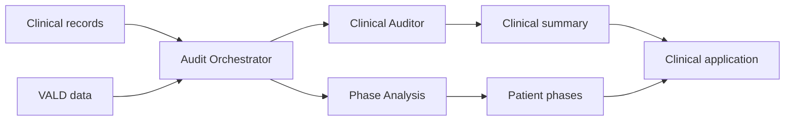

# Stance AI Clinical Summarizer

## Executive Project Overview

### 1. Purpose

Stance is an AI-assisted rehabilitation decision-support platform. It combines longitudinal clinical records with objective VALD performance data and produces:

- A concise clinical summary of the patient's condition, progress, risks, and missing information.
- A phase-wise rehabilitation analysis comparing expected recovery with actual progress.

The product reduces the time required to review fragmented patient history and gives clinicians a consistent view of the rehabilitation journey. It supports clinical judgment; it does not replace the clinician.

### 2. Client explanation

> The platform brings a patient's clinical assessments and VALD measurements into one chronological timeline. Specialized AI pipelines then generate a concise clinical summary and a rehabilitation phase analysis. A central orchestrator monitors relevant patient activity and controls when each analysis runs, preventing unnecessary repeated processing. The structured results are stored in MongoDB and displayed through the clinical application for clinician review.

### 3. Production architecture

The application is deployed as three independent backend services:

| Service | Responsibility | Output |
|---|---|---|
| Clinical Auditor | Explains the patient's overall clinical status and progress | Structured clinical summary |
| Phase Analysis | Explains the patient's position in the rehabilitation pathway | Structured phase analysis |
| Audit Orchestrator | Decides when and which pipeline should run | Queue and operational state |

Nginx provides HTTPS and WebSocket routing in front of these services.



#### Clinical Auditor — port 5001

The Clinical Auditor:

1. Loads clinical history and VALD measurements from MongoDB.
2. Builds a chronological patient timeline.
3. Uses Gemini to produce an evidence-informed assessment.
4. Uses a concise-summary stage to normalize the report.
5. Parses the report into structured fields.
6. Upserts the result into the configured summary collection.

The output covers the patient overview, complaint, provisional diagnosis, objective evidence, progress, areas of concern, information gaps, adherence, and references.

#### Phase Analysis — port 5002

The Phase Analysis service uses the same patient timeline but answers a different question: where the patient is in the rehabilitation pathway.

It produces ideal-versus-actual phase dates, expected and completed sessions, clinical focus, exit criteria, functional status, missed areas, immediate priorities, future phases, and phase-mismatch alerts. Results are upserted into the patient phase collection.

#### Audit Orchestrator — port 5003

The orchestrator contains no clinical AI. It:

- Watches clinical report and VALD changes through MongoDB change streams.
- Filters processing to configured centers.
- Deduplicates repeated edits to the same report or VALD record.
- Maintains one processing record per patient.
- Applies automatic-generation thresholds.
- Dispatches summary and phase processing.
- Handles manual frontend triggers.
- Controls concurrency, retry attempts, and estimated processing cost.

### 4. Data flow

```text
MongoDB clinical records + VALD records
    → normalize and sort chronologically
    → create hierarchical patient timeline
    → run the requested AI pipeline
    → validate and structure the AI response
    → upsert the patient result in MongoDB
    → display the result in the frontend
```

Primary data stores:

| Data store | Role |
|---|---|
| `structured-user-reports` | Consolidated clinical history used by the AI pipeline |
| `vald-exercise-data` | Objective VALD measurements |
| `pending_audits` | Per-patient orchestration state |
| Summary collection | Final structured clinical summaries |
| Phase collection | Final structured phase analysis |
| `orchestrator_resume_tokens` | Change-stream recovery positions |
| `orchestrator_cost_reports` | Estimated daily generation cost |

### 5. Generation workflows

#### Automatic

The orchestrator accumulates distinct report and VALD changes. With current code defaults, processing becomes eligible after five distinct clinical report edits, five distinct VALD edits, or the configured fallback condition.

Automatic processing normally dispatches both summary and phase pipelines.

#### Manual

The frontend sends a WebSocket request for either summary or phase analysis. The receiving service delegates the request to the orchestrator. The orchestrator checks the selected pipeline and either dispatches it or reports that the result is already up to date.

### 6. AI design

The system separates responsibilities across specialized stages:

- **Evidence-Based Assessment:** Interprets the full longitudinal record and can use Google Search grounding for supporting evidence.
- **Concise Summary:** Converts the comprehensive assessment into a stable, frontend-friendly clinical summary.
- **Phase Intelligence:** Applies a structured rehabilitation framework and compares expected phases with actual patient activity.

Gemini fallback models are configured so temporary model availability or rate-limit problems can move processing to another model.

### 7. Business value

- Faster review of long patient histories.
- Consistent clinical summaries across patients.
- Clear correlation between clinical observations and VALD measurements.
- Better visibility into improvement, plateau, regression, and missing information.
- Phase-level comparison of expected and actual rehabilitation.
- Centralized control of AI triggers, concurrency, and estimated cost.
- Structured outputs suitable for dashboards and integrations.

### 8. Technology and deployment

| Layer | Technology |
|---|---|
| APIs | Python, FastAPI, Uvicorn |
| Database | MongoDB Atlas, PyMongo change streams |
| AI | Google Vertex AI, Gemini, Google Search grounding |
| Real-time communication | WebSockets |
| Packaging | Docker and Docker Compose |
| Public routing | Nginx with TLS |
| Hosting and delivery | AWS EC2 and GitHub Actions |

The frontend is not part of this repository.

### 9. Current scope

Implemented capabilities include MongoDB ingestion, chronological timeline preparation, AI summary generation, phase analysis, structured persistence, automatic orchestration, manual triggers, WebSocket communication, cost estimation, containerized deployment, and HTTPS routing.

The system should be presented as clinician-reviewed decision support. Security controls, clinical governance, monitoring, test coverage, and reliable end-to-end completion tracking must be evaluated as part of production operations rather than assumed from the AI workflow alone.

### 10. Genuine KT confirmations

These are the points worth confirming with the previous developer because they represent business intent or live production state, not facts that static source review alone can prove:

1. **Clinical scope:** Which diagnoses, procedures, and rehabilitation protocols are officially supported and clinically approved?
2. **Clinical ownership:** Who signs off generated output, and what is the correction/escalation process for an inaccurate report?
3. **Manual-generation policy:** Should Generate always force a fresh result, or intentionally return “up to date” when no tracked change exists?
4. **Production security boundary:** Which gateway, identity system, network rule, and user roles protect access to patient data and generation endpoints?
5. **Production service levels:** What latency, availability, retry, and incident-response targets were agreed with the client?
6. **Live operational ownership:** Who monitors queue failures, AI failures, MongoDB change streams, cost, and deployment health?
7. **Data governance:** What consent, retention, residency, audit, and redaction policies apply to patient data sent to Vertex AI and search grounding?
8. **Client acceptance:** Which sample outputs and measurable acceptance criteria have been approved by the client?

Everything else—service responsibilities, ports, endpoints, queue rules, collections, models, processing flow, and deployment definitions—should be obtained directly from the repository and live environment rather than asked as basic KT questions.

### 11. Final summary

Remember the system in three lines:

> **The Orchestrator decides when processing runs.**
>
> **The Clinical Auditor explains the patient's overall clinical status.**
>
> **Phase Analysis explains where the patient is in the rehabilitation journey.**

The full client statement is:

> Stance converts fragmented clinical and VALD history into a chronological patient view, then uses specialized AI services to generate a concise clinical summary and a phase-wise rehabilitation analysis. A central orchestrator controls processing, while clinicians retain responsibility for reviewing and acting on the results.
